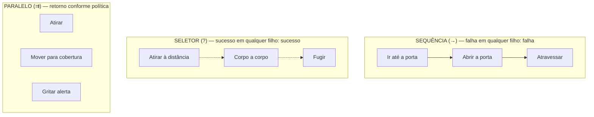
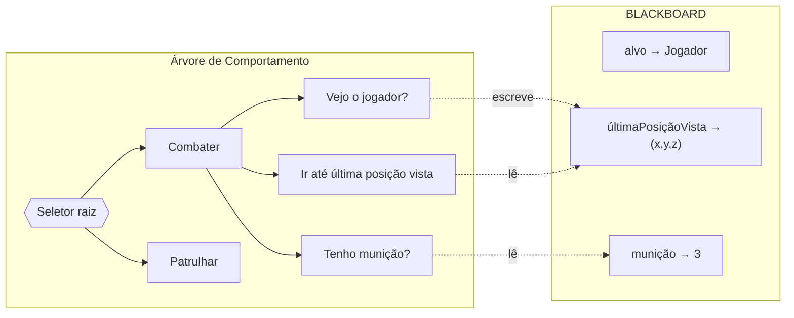
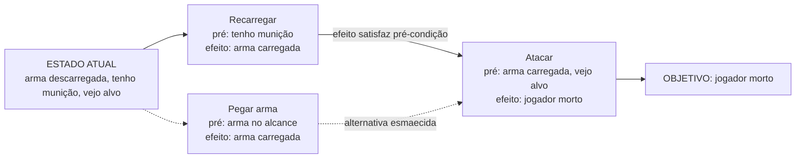
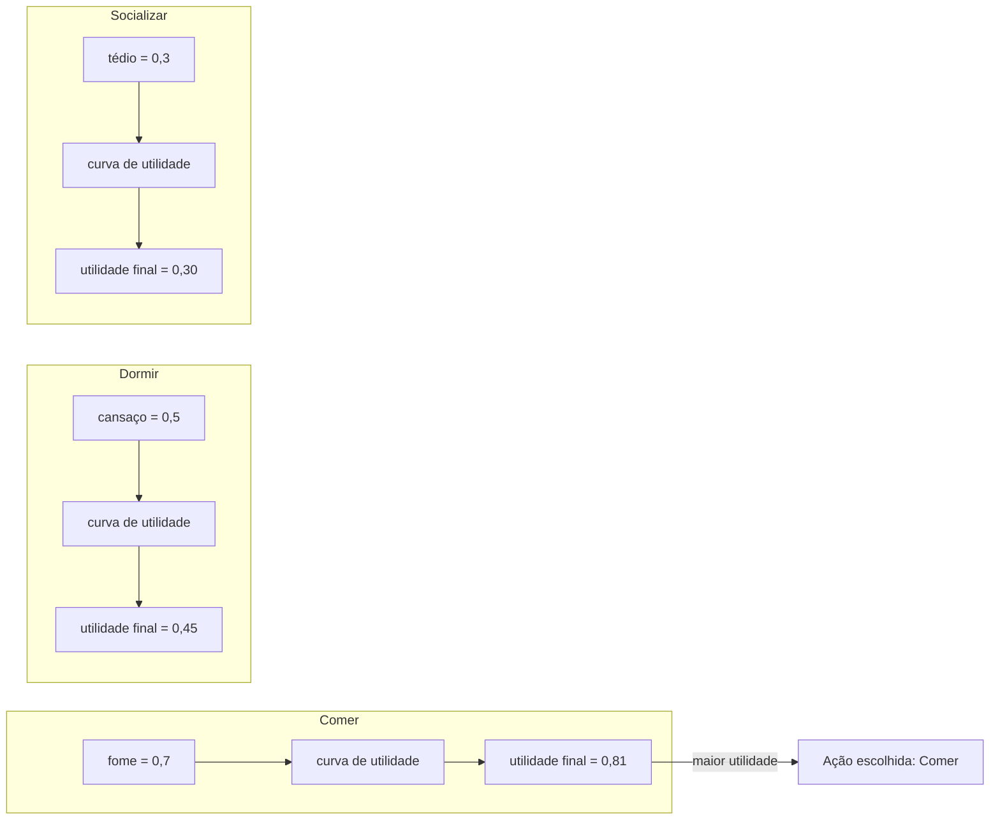

# Capítulo 6 — Árvores de Comportamento (Behavior Trees)

> **Capítulo de ênfase da Parte II.** Este é o capítulo central da Parte e atende, como definido no Planejamento Editorial, ao item "árvores de decisão" da ementa por meio da **árvore de comportamento** — a arquitetura de tomada de decisão dominante na indústria de jogos contemporânea. As seções 6.1 a 6.5 e 6.8 a 6.11 constituem o **conteúdo essencial**. As seções 6.6 (**GOAP**) e 6.7 (**IA de utilidade**) são **conteúdo de aprofundamento**: apresentam extensões modernas de tomada de decisão, para enriquecer a formação, sem competir em importância com o núcleo de árvores de comportamento.

## Introdução

Chegamos ao destino para o qual toda a Parte II vinha convergindo. Vimos a **máquina de estados finita** (Capítulo 3) organizar comportamento em modos, e sofrer com a explosão de transições. Vimos a **máquina de estados hierárquica** (Capítulo 4) domar parte dessa complexidade com hierarquia, mas ainda presa ao acoplamento e à rigidez dos estados. Vimos a **árvore de decisão** (Capítulo 5) classificar situações em ações, mas sem noção de tempo, de sequência ou de reutilização. Cada arquitetura resolveu um problema e legou outro. A **árvore de comportamento** (do inglês *Behavior Tree*, BT) é a síntese que a indústria encontrou para os problemas remanescentes — e a razão de ela ter se tornado, desde meados dos anos 2000, o padrão de fato para a IA de decisão de NPCs em jogos de médio e grande porte.

A promessa da árvore de comportamento é conciliar quatro qualidades que as arquiteturas anteriores só ofereciam parcialmente e nunca todas juntas: a **legibilidade visual** da árvore de decisão, a **capacidade de sequenciar e priorizar** comportamentos ao longo do tempo, a **modularidade e reutilização** de blocos de comportamento, e a **facilidade de autoria** por designers em ferramentas gráficas. Ela realiza isso com um punhado de ideias engenhosas: nós que *controlam o fluxo* de execução (em vez de apenas testar condições), um mecanismo de *ticks* que percorre a árvore a cada quadro, e um protocolo de **estados de retorno** — sucesso, falha e *em execução* — que dá às tarefas a noção de duração que faltava a tudo o que vimos até aqui.

Este capítulo é o mais extenso da Parte, à altura de sua importância. Seguimos o roteiro da apostila com rigor: o **problema** que a BT resolve, seus **fundamentos** (nós compostos, decoradores, folhas e blackboard), seu **funcionamento** (ticks, fluxo e estados de retorno), **exemplos** completos de comportamento de guarda, as **vantagens e limitações**, os dois **aprofundamentos** modernos (GOAP e utilidade), um **quadro comparativo** consolidando toda a Parte, os **jogos conhecidos** (Halo, F.E.A.R., The Sims), as **ferramentas** (o pacote Unity Behavior e os terceiros) e o fechamento com **exercícios**.

> 🕰️ **Contexto Histórico**
> As árvores de comportamento emergiram na indústria de jogos em meados dos anos 2000, com um marco frequentemente citado: a IA de *Halo 2* (Bungie, 2004), cuja equipe desenvolveu e mais tarde documentou publicamente (em palestras e artigos técnicos) uma arquitetura baseada em árvores de comportamento para orquestrar o comportamento dos inimigos. A técnica se difundiu rapidamente porque respondia a uma dor concreta e generalizada: as HFSMs dos jogos, cada vez maiores, tornavam-se difíceis de manter e reutilizar. Em poucos anos, as árvores de comportamento passaram de novidade a padrão, incorporadas a engines e ferramentas comerciais. É um exemplo perfeito da lição da Parte I: uma técnica nasce quando um problema de produção a torna necessária e o ferramental a torna viável.

---

## 6.1 O problema: limites de FSMs e árvores de decisão em jogos complexos *(essencial)*

Consolidemos, em um único diagnóstico, os problemas que as arquiteturas anteriores deixaram sem solução satisfatória — pois é exatamente a esse conjunto que a árvore de comportamento responde.

**Da FSM e da HFSM, herdamos dois problemas.** O primeiro é o **acoplamento**: numa máquina de estados, cada estado precisa conhecer explicitamente seus destinos de transição. Esse conhecimento espalhado significa que mover, renomear ou reordenar comportamentos exige mexer em muitos pontos, e que reutilizar um estado em outro contexto é trabalhoso, porque ele carrega consigo suas transições. O segundo é a **rigidez de reordenação**: mudar a prioridade entre comportamentos (por exemplo, "agora recarregar deve vir antes de recuar") significa reescrever transições, não simplesmente reordenar uma lista.

**Da árvore de decisão, herdamos outros dois.** A **ausência de tempo e sequência**: a árvore de decisão escolhe *uma* ação instantânea; ela não sabe expressar "faça A; ao terminar, faça B; ao terminar, faça C", nem "continue fazendo A por vários quadros até concluir". E a **fraca reutilização e composição**: subárvores comuns são copiadas, e não há um modo limpo de montar comportamentos grandes a partir de blocos pequenos e independentes.

Reunindo tudo, o problema que a indústria precisava resolver era: **como descrever comportamentos ricos, que se estendem no tempo e se compõem de sequências e alternativas priorizadas, de um modo que seja modular, reutilizável, visualmente editável por designers e barato de executar — sem o acoplamento das máquinas de estado?**

A resposta da árvore de comportamento assenta sobre uma inversão conceitual elegante. Numa FSM, o conhecimento do fluxo mora nas **transições** entre estados: cada estado diz para onde ir. Numa BT, o conhecimento do fluxo mora na **estrutura da árvore**: são os *nós internos* que decidem, a cada momento, qual filho executar, e os comportamentos-folha não precisam saber *nada* sobre o que vem antes ou depois deles. Um comportamento "procurar cobertura" é apenas uma folha que faz seu trabalho e informa se teve sucesso ou não; *onde* ela é usada, e *o que* acontece em seguida, é decisão da árvore, não da folha. Esse **desacoplamento entre o comportamento e o controle do fluxo** é a chave de toda a modularidade e reutilização das BTs.

> 🎮 **Na Prática**
> A melhor forma de sentir a diferença é pensar em como se *edita* cada arquitetura. Para mudar a prioridade de comportamentos numa FSM, você reescreve transições espalhadas. Numa árvore de comportamento, você **reordena filhos numa lista** — literalmente arrasta um nó para cima ou para baixo num editor visual. Para reutilizar um comportamento, na FSM você copia um estado e recria suas transições; na BT, você **encaixa a mesma subárvore** em outro lugar, e ela funciona, porque não conhece o contexto. Essa facilidade de edição e reúso é o que fez designers e programadores adotarem as BTs em massa.

---

## 6.2 Fundamentos das árvores de comportamento *(essencial)*

Uma árvore de comportamento é uma árvore em que a **raiz** representa o comportamento global do agente e os **nós** se dividem em três grandes categorias: **nós compostos** (que controlam o fluxo entre vários filhos), **decoradores** (que modificam um único filho) e **nós de folha** (que fazem o trabalho concreto — ações e condições). A execução parte da raiz e desce pela árvore segundo as regras dos nós compostos, e cada nó, ao ser executado, devolve ao pai um **estado de retorno**: *sucesso*, *falha* ou *em execução* (que a seção 6.3 detalha). Essa gramática pequena — três tipos de nó e três estados de retorno — é suficiente para expressar comportamentos de enorme riqueza.

### 6.2.1 Nós compostos (sequência, seletor, paralelo)

Os **nós compostos** (ou *nós de controle*) são o coração da árvore de comportamento: são eles que decidem, com base nos estados de retorno dos filhos, como o fluxo de execução progride. Possuem *vários* filhos e definem a semântica de como percorrê-los. Os três nós compostos fundamentais são a sequência, o seletor e o paralelo.

**Sequência (*Sequence*).** Executa seus filhos **em ordem**, da esquerda para a direita, exigindo que **todos** tenham sucesso. Ao executar um filho: se ele *falha*, a sequência inteira **falha** imediatamente (não adianta continuar — um passo essencial deu errado); se ele tem *sucesso*, a sequência prossegue para o próximo filho; se todos os filhos têm sucesso, a sequência **tem sucesso**. A sequência é a **conjunção lógica** (o "E") do comportamento: "faça isto E aquilo E aquilo outro, nesta ordem". É a ferramenta para **encadear passos dependentes**: "ir até a porta E abrir a porta E atravessar" — se não conseguir ir até a porta, não faz sentido tentar abri-la.

**Seletor (*Selector*, também chamado *Fallback*).** Executa seus filhos **em ordem** até que **um** tenha sucesso. Ao executar um filho: se ele tem *sucesso*, o seletor **tem sucesso** imediatamente (achamos uma alternativa que funcionou); se ele *falha*, o seletor tenta o **próximo** filho; se todos falham, o seletor **falha**. O seletor é a **disjunção lógica** (o "OU") e, sobretudo, o mecanismo de **prioridade e plano B**: "tente atacar à distância; se não der, aproxime-se e ataque corpo a corpo; se não der, fuja". Os filhos ficam em ordem de preferência, e o seletor escolhe o primeiro que consegue agir. Reordenar prioridades é, aqui, literalmente reordenar os filhos.

**Paralelo (*Parallel*).** Executa **todos** os seus filhos **ao mesmo tempo** (conceitualmente — na prática, todos são "tickados" no mesmo quadro), e seu estado de retorno depende de uma **política** configurável: por exemplo, "sucesso quando *todos* os filhos tiverem sucesso" ou "sucesso quando *um* tiver sucesso" (e simetricamente para falha). O paralelo resolve, de forma nativa, aquilo que era desajeitado na FSM: **comportamentos concorrentes**. "Atirar no inimigo *enquanto* se move para a cobertura *enquanto* grita um alerta" é um paralelo de três filhos. Ele deve ser usado com parcimônia, pois comportamentos genuinamente simultâneos são menos comuns — e mais propensos a conflitos — do que se imagina.

[DIAGRAMA]
Título: Os três nós compostos fundamentais
Objetivo pedagógico: Fixar a semântica de Sequência, Seletor e Paralelo, evidenciando como cada um reage aos estados de retorno dos filhos.
Descrição detalhada: Três mini-árvores lado a lado, cada uma com um nó composto no topo e três folhas abaixo. (A) SEQUÊNCIA (símbolo "→"): setas indicando execução da esquerda para a direita; anotação "falha em qualquer filho → sequência falha; todos com sucesso → sucesso". Exemplo nas folhas: "Ir até a porta → Abrir a porta → Atravessar". (B) SELETOR (símbolo "?"): execução da esquerda para a direita até o primeiro sucesso; anotação "sucesso em qualquer filho → seletor tem sucesso; todos falham → falha". Exemplo: "Atirar à distância ? Corpo a corpo ? Fugir". (C) PARALELO (símbolo "⇉"): as três folhas executadas simultaneamente; anotação "estado de retorno conforme política (todos/qualquer)". Exemplo: "Atirar ⇉ Mover para cobertura ⇉ Gritar alerta". Usar cores para os estados de retorno (verde=sucesso, vermelho=falha, azul=em execução) numa pequena legenda.
Elementos obrigatórios: três nós compostos com seus símbolos; folhas de exemplo; anotações da semântica de cada um; legenda dos estados de retorno.


[/DIAGRAMA]

> ✅ **Boa Prática**
> Um padrão idiomático das árvores de comportamento é o **seletor de prioridades no topo**: a raiz costuma ser um seletor cujos filhos são subárvores de comportamento em ordem decrescente de prioridade — sobrevivência primeiro, depois combate, depois investigação, depois patrulha. A cada tick, o agente naturalmente executa o comportamento mais prioritário que *consegue* executar naquele momento. Essa organização torna a prioridade **explícita e visual**: ela é, simplesmente, a ordem dos filhos do seletor-raiz. Comparada à replicação de transições de sobrevivência que a HFSM exigia, é uma simplificação notável.

### 6.2.2 Decoradores e nós de folha (ação/condição)

**Nós de folha.** As folhas são onde o comportamento *acontece*; elas não têm filhos. Dividem-se em dois tipos:

As **ações** (*action nodes*) executam algo no mundo do jogo: mover-se até um ponto, tocar uma animação, disparar, falar. Uma ação retorna *sucesso* quando conclui seu objetivo, *falha* quando não consegue, e *em execução* enquanto ainda está trabalhando (uma animação que ainda não terminou, um deslocamento em curso). São as ações que se conectam às fases *Sentir* e *Agir* do ciclo do agente.

As **condições** (*condition nodes*) testam algo sobre o estado do mundo ou do agente e retornam *sucesso* (verdadeiro) ou *falha* (falso), sem alterar nada. "O jogador está à vista?", "minha vida é maior que 30%?", "tenho munição?". As condições são o que aproxima a BT da árvore de decisão do Capítulo 5 — mas, aqui, elas servem para *guiar o fluxo* dentro de sequências e seletores, não para chegar a uma folha-ação terminal. Um padrão comum é uma sequência que começa por uma condição: "SE (condição) E (ação)" — a sequência só executa a ação se a condição, avaliada primeiro, tiver sucesso.

**Decoradores.** Um **decorador** é um nó com **exatamente um filho**, cuja função é **modificar** o comportamento ou o estado de retorno desse filho. Decoradores são a fonte de boa parte da expressividade e da elegância das BTs. Os mais comuns:

- **Inversor (*Inverter*)** — troca sucesso por falha e vice-versa. Transforma "tenho munição?" em "*não* tenho munição?", útil para expressar condições negativas sem escrever novas folhas.
- **Repetidor (*Repeat*)** — executa o filho repetidamente, um número de vezes ou indefinidamente. Útil para laços ("patrulhar continuamente").
- **Sucesso/Falha forçados** — fazem o filho sempre retornar sucesso (ou falha), independentemente do resultado real. Úteis para "tentar algo opcional sem que sua falha derrube a sequência".
- **Guarda/Condição de decorador (*Conditional decorator*)** — só permite executar o filho se uma condição for satisfeita, funcionando como uma "porteira".
- **Cooldown / Temporizador** — impede que o filho seja reexecutado antes de decorrido certo tempo, ou limita sua duração. Essencial para ritmar comportamentos ("não lançar granada mais de uma vez a cada 10 s").

> 🎲 **Curiosidade**
> A palavra "decorador" vem do padrão de projeto *Decorator* da engenharia de software, no qual um objeto "embrulha" outro para acrescentar comportamento sem alterá-lo. A escolha do termo não é acidental: as árvores de comportamento foram, desde cedo, pensadas com o vocabulário de *design patterns* de software, e é por isso que dialogam tão bem com boas práticas de programação — modularidade, composição, responsabilidade única. Uma folha faz *uma* coisa; um decorador acrescenta *um* aspecto; um composto orquestra o fluxo. Cada nó tem uma responsabilidade clara.

### 6.2.3 Blackboard e compartilhamento de dados

Falta um ingrediente para que a árvore seja útil na prática: os nós precisam **compartilhar informação**. A condição "o jogador está à vista?" precisa registrar *onde* o jogador foi visto, para que a ação "ir até a última posição conhecida" saiba para onde ir. Como as folhas são desacopladas e não conhecem umas às outras, elas não podem trocar dados diretamente. A solução é uma **memória compartilhada** chamada **blackboard** ("quadro-negro").

O **blackboard** é um repositório de dados nomeados — um dicionário de "chave → valor" — acessível a todos os nós da árvore (e, às vezes, compartilhado entre agentes). Nele ficam as informações que o comportamento precisa: a última posição vista do jogador, o alvo atual, o ponto de cobertura escolhido, o nível de munição, o estado de alerta. Os nós **leem e escrevem** no blackboard: a condição de percepção escreve "últimaPosiçãoVista"; a ação de perseguição lê essa chave. Assim, os nós permanecem desacoplados entre si — comunicam-se *através do quadro*, não diretamente.

O blackboard cumpre, para a BT, um papel análogo ao que a "memória de estado" cumpria na FSM/HFSM, mas de forma centralizada e explícita. Ele também é o ponto de integração com o resto do jogo: o sistema de percepção escreve no blackboard o que o agente "sente"; o sistema de animação lê dele o que deve "mostrar". O blackboard é, em muitos sentidos, a materialização da fase *Sentir* alimentando a fase *Pensar*.

[DIAGRAMA]
Título: Árvore de comportamento e blackboard
Objetivo pedagógico: Mostrar como os nós de uma BT se comunicam indiretamente por meio do blackboard, mantendo o desacoplamento.
Descrição detalhada: À esquerda, uma árvore de comportamento simples (um seletor-raiz com duas subárvores: "Combater" e "Patrulhar"). À direita, um retângulo rotulado "BLACKBOARD" listando pares chave→valor: "alvo → Jogador", "últimaPosiçãoVista → (x,y,z)", "munição → 3", "emAlerta → verdadeiro". Setas tracejadas ligam nós específicos ao blackboard: a condição "Vejo o jogador?" com uma seta de *escrita* para "últimaPosiçãoVista"; a ação "Ir até última posição" com uma seta de *leitura* de "últimaPosiçãoVista"; a condição "Tenho munição?" com seta de leitura de "munição". Rotular as setas como "lê" e "escreve". Uma nota lateral: "os nós não se comunicam diretamente — apenas através do blackboard".
Elementos obrigatórios: árvore de comportamento à esquerda; blackboard com pares chave→valor à direita; setas de leitura e escrita entre nós e chaves; nota sobre desacoplamento.


[/DIAGRAMA]

> ⚠️ **Atenção**
> O blackboard é poderoso, mas pode virar uma "lata de lixo global" se usado sem disciplina. Despejar todo tipo de dado nele, com nomes inconsistentes e sem clareza sobre quem escreve e quem lê cada chave, recria — em forma de dados — o acoplamento que a árvore de comportamento veio eliminar. Boa prática: documentar as chaves do blackboard, manter nomes consistentes e restringir o que cada subárvore lê e escreve. O desacoplamento das BTs só se sustenta se o blackboard for tratado com o mesmo cuidado que uma interface de módulo.

---

## 6.3 Funcionamento: ticks, fluxo de execução e estados de retorno *(essencial)*

Vistos os componentes, examinemos como a árvore efetivamente *roda*. O mecanismo é conhecido como **tick**: a cada quadro (ou a intervalos regulares), a árvore é "tickada" a partir da **raiz**, e essa chamada se propaga árvore abaixo, filho a filho, conforme a semântica dos nós compostos, até que a raiz devolva um estado de retorno. Um *tick* é, portanto, uma **travessia da árvore** guiada pelos resultados dos nós.

O elemento que torna tudo isso mais rico do que uma árvore de decisão é o terceiro estado de retorno: **em execução** (*running*). Recapitulando os três:

- **Sucesso (*Success*)** — o nó concluiu seu objetivo com êxito.
- **Falha (*Failure*)** — o nó não conseguiu concluir seu objetivo.
- **Em execução (*Running*)** — o nó **ainda está trabalhando** e precisa de mais tempo; não terminou nem falhou.

O estado *em execução* é a peça que dá às árvores de comportamento a **noção de duração** que faltava a todas as arquiteturas anteriores. Uma ação como "ir até a cobertura" não acontece num instante: ela leva vários quadros. Enquanto o agente caminha, a ação retorna *em execução* a cada tick; quando chega, retorna *sucesso*; se o caminho é bloqueado, retorna *falha*. Os nós compostos sabem lidar com isso: quando um filho de uma sequência retorna *em execução*, a **sequência também retorna em execução** e, no próximo tick, retoma *daquele filho* — não recomeça do primeiro. Esse é o mecanismo pelo qual a árvore "lembra" onde estava sem precisar de estados persistentes ao estilo FSM.

O pseudocódigo a seguir ilustra a semântica de tick de uma **sequência** e de um **seletor**, os dois compostos essenciais:

```
tick da SEQUÊNCIA (filhos em ordem):
    para cada filho, a partir do último que estava "em execução":
        resultado = tick(filho)
        se resultado == FALHA:  retornar FALHA        # um passo falhou
        se resultado == EM_EXECUÇÃO:  retornar EM_EXECUÇÃO   # espere o passo terminar
        # se SUCESSO, continua para o próximo filho
    retornar SUCESSO                                   # todos tiveram sucesso

tick do SELETOR (filhos em ordem de prioridade):
    para cada filho, a partir do último que estava "em execução":
        resultado = tick(filho)
        se resultado == SUCESSO:  retornar SUCESSO     # achou alternativa que funcionou
        se resultado == EM_EXECUÇÃO:  retornar EM_EXECUÇÃO
        # se FALHA, tenta o próximo filho
    retornar FALHA                                     # todas as alternativas falharam
```

**Análise interpretativa.** Note a bela simetria: a sequência é otimista para *sucesso* (continua enquanto tudo dá certo, aborta na primeira falha) e o seletor é otimista para *falha* (continua tentando enquanto as alternativas falham, aborta no primeiro sucesso). Juntos, sequência e seletor bastam para expressar a lógica "faça esta sequência de passos; se algum falhar, caia para o plano B". E o estado *em execução* costura tudo ao tempo real: a árvore inteira pode ficar "pausada" num nó que ainda trabalha, retomando exatamente dali no próximo quadro. Essa combinação de composição lógica (E/OU via sequência/seletor) com continuidade temporal (running) é o que faz a árvore de comportamento tão mais expressiva do que a árvore de decisão da qual herdou a forma.

Um ponto de projeto importante é o comportamento de **reavaliação**. Numa implementação básica, cada tick recomeça da raiz e desce, o que faz a árvore reavaliar naturalmente as prioridades: se, enquanto o agente patrulhava, o jogador aparece, o seletor-raiz — reavaliado do topo — passa a escolher a subárvore de combate, mais prioritária, interrompendo a patrulha. Esse "interromper o menos prioritário quando surge algo mais importante" é frequentemente refinado com **decoradores de interrupção** (às vezes chamados de *reactive* ou *conditional aborts*), que permitem abortar um ramo em execução quando uma condição de maior prioridade se torna verdadeira. É esse mecanismo que dá às BTs sua **reatividade**: elas não apenas executam planos, mas reagem a mudanças, largando o que faziam quando algo mais urgente acontece.

> ❌ **Erro Comum**
> Supor que, uma vez iniciada, uma sequência sempre roda até o fim. Numa árvore *reativa* (com reavaliação a partir da raiz e/ou decoradores de interrupção), um ramo em execução pode ser **abortado** se um comportamento de maior prioridade se tornar viável. Ignorar isso leva a dois erros opostos: esperar que o agente termine uma sequência longa quando ele deveria reagir a uma ameaça, ou, ao contrário, deixar comportamentos serem interrompidos no meio de forma indesejada (o agente "gagueja", recomeçando ações). Projetar *onde* permitir interrupções — e onde proteger uma sequência de ser abortada — é parte central do bom uso das BTs.

> 🎮 **Na Prática**
> O custo de execução de uma BT é geralmente baixo, mas não nulo: tickar a árvore inteira, a partir da raiz, a cada quadro, para muitos agentes, pode pesar. As mesmas estratégias da Parte I se aplicam: reduzir a frequência de tick para agentes distantes (LOD de IA), evitar reavaliar subárvores caras a cada quadro, e usar *event-driven behavior trees*, uma variante em que a árvore só é reavaliada quando um evento relevante muda o blackboard, em vez de a cada quadro — o análogo, nas BTs, da FSM por eventos do Capítulo 3.

---

## 6.4 Exemplos: comportamento de guarda, patrulha e combate com Behavior Tree *(essencial)*

Retomemos, pela última vez, o **inimigo guarda** que acompanhou toda a Parte II — agora expresso como árvore de comportamento. A comparação com a FSM do Capítulo 3 e a HFSM do Capítulo 4 será instrutiva: o *mesmo* comportamento, três arquiteturas, três formas de organizá-lo.

A árvore terá, no topo, um **seletor-raiz de prioridades**, cujos filhos são, em ordem decrescente de prioridade, as subárvores: *Sobreviver*, *Combater*, *Investigar* e *Patrulhar*. A cada tick, o agente executa a subárvore mais prioritária que consegue executar. Descrevemos cada subárvore:

**Subárvore *Sobreviver*** (prioridade máxima) — uma **sequência**: [Condição: "vida < 20%?"] → [Ação: "fugir para aliados"]. A sequência só age se a condição de vida baixa for verdadeira; caso contrário, falha rapidamente e o seletor-raiz passa adiante. Isso substitui, com um único bloco no topo, a transição "vida < 20% → Fugir" que a HFSM precisava herdar e a FSM plana precisava replicar.

**Subárvore *Combater*** — uma **sequência** que começa por uma condição de percepção: [Condição: "vejo o jogador?"] → [Seletor de táticas]. O seletor de táticas escolhe, em ordem: [Sequência: "distância < 2 m?" → "atacar corpo a corpo"] ? [Sequência: "tenho munição?" → "atirar"] ? [Ação: "recarregar"] ? [Ação: "avançar para cobertura"]. Assim, o guarda ataca corpo a corpo se colado, atira se tem munição, recarrega se está sem, e avança se nada disso se aplica — tudo com prioridades visíveis na ordem dos filhos.

**Subárvore *Investigar*** — uma **sequência**: [Condição: "ouvi um ruído recentemente?"] → [Ação: "ir até a última posição do ruído"] → [Ação: "olhar em volta por alguns segundos"]. Enquanto o agente caminha e observa, as ações retornam *em execução*, e a sequência fica "pausada" nelas. Se, nesse meio-tempo, o jogador aparecer, o seletor-raiz — reavaliado — passará à subárvore *Combater*, mais prioritária, abortando a investigação. Credibilidade, de novo, fabricada de forma barata.

**Subárvore *Patrulhar*** (prioridade mínima, o comportamento "padrão") — um **repetidor** sobre uma **sequência**: [Ação: "ir ao próximo ponto de rota"] → [Ação: "aguardar e observar"]. É o que o guarda faz quando nada mais é aplicável.

[IMAGEM NECESSÁRIA]
Título: Árvore de comportamento completa do inimigo guarda
Objetivo didático: Permitir que o aluno visualize a BT integral descrita no texto e a compare mentalmente com a FSM (Fig. 3.1) e a HFSM (Fig. 4.1) do mesmo agente.
Descrição: Diagrama de árvore de comportamento, de cima para baixo. Raiz: um SELETOR (símbolo "?") de prioridades, com quatro filhos da esquerda (maior prioridade) para a direita (menor): (1) Subárvore "Sobreviver" — sequência com condição "vida < 20%?" e ação "Fugir"; (2) Subárvore "Combater" — sequência "vejo o jogador?" seguida de um seletor de táticas (corpo a corpo / atirar / recarregar / avançar); (3) Subárvore "Investigar" — sequência "ouvi ruído?" → "ir ao local" → "olhar em volta"; (4) Subárvore "Patrulhar" — repetidor sobre sequência "ir ao ponto" → "aguardar". Usar os símbolos padronizados: "?" para seletor, "→" para sequência, losango para condições, retângulo para ações, e um símbolo de decorador para o repetidor. Legenda de cores para os estados de retorno.
Tipo: Diagrama de árvore de comportamento (ilustração vetorial)
Como produzir: Ferramenta de diagramação com nós de BT (draw.io com biblioteca de BT, Figma, ou editor dedicado); manter os símbolos consistentes com os diagramas do capítulo e com a notação usada em ferramentas como o pacote Unity Behavior.
Legenda sugerida: Figura 6.1 — O mesmo inimigo dos Capítulos 3 e 4, agora como árvore de comportamento: um seletor-raiz de prioridades orquestra sobreviver, combater, investigar e patrulhar, com a prioridade tornada visível pela ordem dos ramos.
[/IMAGEM NECESSÁRIA]

**Análise interpretativa comparativa.** Contraste as três versões do guarda. Na **FSM** (Cap. 3), a lógica vivia nas *transições* entre cinco estados, e a regra de sobrevivência se espalhava por vários deles. Na **HFSM** (Cap. 4), a hierarquia agrupou estados e permitiu herdar a regra de sobrevivência uma vez — um avanço de organização. Na **BT**, a regra de sobrevivência é simplesmente **o primeiro filho do seletor-raiz**: sua prioridade é a sua *posição*. Mudar prioridades é reordenar filhos; adicionar um comportamento é inserir uma subárvore; reutilizar "avançar para cobertura" em outro agente é copiar aquela folha, que nada sabe do contexto. O comportamento observável é praticamente o mesmo nas três; o que muda — e muda decisivamente — é a **facilidade de construir, editar, reutilizar e depurar**. É por isso, e não por produzir agentes "mais inteligentes", que a indústria adotou as árvores de comportamento.

> 🏭 **Na Indústria**
> Um padrão profissional recorrente é usar a árvore de comportamento como o "cérebro" (a decisão) e uma **máquina de estados de animação** como o "corpo" (a apresentação). A folha "atirar" da BT não anima nada diretamente: ela escreve no blackboard "estado = atirando", e o Animator (uma FSM, como vimos no Cap. 3) cuida de tocar a animação certa e transicioná-la suavemente. Essa divisão "BT decide, FSM anima" combina o melhor das duas arquiteturas e é a arquitetura de fato de muitos jogos comerciais — um exemplo concreto da lição de que as técnicas se acumulam em camadas, não se substituem.

---

## 6.5 Vantagens e limitações das árvores de comportamento *(essencial)*

**Vantagens.**

A árvore de comportamento reúne, num só pacote, as qualidades que as arquiteturas anteriores ofereciam apenas em parte. Sua **modularidade e reutilização** são a virtude central: como as folhas são desacopladas do contexto, subárvores inteiras podem ser reaproveitadas entre agentes e projetos, e comportamentos grandes se montam a partir de blocos pequenos e independentes. A **legibilidade** é alta: a estrutura em árvore, com sequência e seletor, lê-se quase como um roteiro ("faça isto; se falhar, tente aquilo"), e a **prioridade fica visível** na ordem dos filhos. A **autoria visual** é natural: as BTs prestam-se a editores gráficos em que designers montam e reordenam comportamento sem programar — atendendo ao critério de controle do designer da Parte I. A **noção de duração** (via estado *em execução*) permite expressar comportamentos que se estendem no tempo, algo impossível na árvore de decisão. A **reatividade** (via reavaliação e decoradores de interrupção) permite reagir a mudanças, largando o que se fazia por algo mais urgente. E a **escalabilidade de manutenção** é muito superior à da FSM: adicionar comportamento é inserir uma subárvore, não reccosturar transições. Tudo isso a baixo **custo computacional**, adequado ao orçamento de quadro.

**Limitações.**

As BTs não são uma panaceia, e reconhecer seus limites é o que abrirá caminho para os aprofundamentos das próximas seções. Primeiro, elas ainda descrevem comportamento de forma **predominantemente prescritiva**: o designer especifica, à mão, *o que* fazer e *em que ordem tentar* — a árvore não *descobre* sozinha um plano para atingir um objetivo. Quando o comportamento desejado é "atinja este objetivo, montando você mesmo a sequência de passos a partir do que é possível agora", a BT exige que o projetista antecipe e codifique todas as sequências relevantes; é aí que entra o **GOAP** (seção 6.6), que faz o agente *planejar*. Segundo, a decisão numa BT é **essencialmente booleana e ordinal**: um filho tem sucesso ou falha, e a prioridade é dada pela ordem; a BT não pondera naturalmente *quão desejável* é cada opção em uma escala contínua. Quando muitas ações competem e a melhor depende de um balanço de fatores graduais ("estou com um pouco de fome, bastante entediado e ligeiramente cansado — o que faço?"), a estrutura rígida da BT fica desajeitada; é aí que entra a **IA de utilidade** (seção 6.7), que pontua opções. Terceiro, árvores muito grandes podem, elas próprias, ficar complexas — embora a modularidade contenha isso muito melhor do que a FSM continha a explosão de transições. E, como toda técnica prescritiva, a BT **não generaliza** para situações não previstas pelo autor: ela faz exatamente o que foi montada para fazer, nem mais, nem menos.

É importante situar essas limitações na medida certa. Elas **não** destronam a árvore de comportamento — que continua sendo a espinha dorsal da IA de decisão na indústria — mas indicam as fronteiras onde outras técnicas de decisão a complementam. As duas seções seguintes, de **aprofundamento**, apresentam essas fronteiras: o planejamento (GOAP) e a pontuação de utilidade (Utility AI). O leitor deve encará-las como *extensões modernas* que ampliam o repertório, e não como substitutas do núcleo que acabou de estudar.

> ✅ **Boa Prática**
> Não trate a árvore de comportamento como martelo universal. Para comportamento *modal* estável (poucos modos bem definidos), uma FSM/HFSM pode ser mais simples. Para decisões *pontuais* por condições, uma árvore de decisão embutida basta. Para comportamento *rico, sequenciado e reutilizável*, a BT é imbatível. E, para os casos das seções seguintes — planejar sequências dinamicamente (GOAP) ou ponderar muitas opções contínuas (utilidade) —, considere combinar a BT com essas técnicas. A maturidade de engenharia está em **escolher e combinar**, não em aplicar sempre a arquitetura da moda.

---

## 6.6 Aprofundamento — Planejamento orientado a objetivos (GOAP) *(aprofundamento)*

> **Conteúdo de aprofundamento.** Esta seção enriquece a formação apresentando uma técnica moderna de decisão. Ela **não** substitui as árvores de comportamento nem tem o peso do conteúdo essencial da Parte; pode ser deixada para um segundo momento de estudo sem prejuízo da compreensão do núcleo.

Todas as arquiteturas vistas até aqui têm algo em comum: o comportamento é **escrito de antemão** pelo designer. A FSM tem seus estados e transições predefinidos; a BT tem suas sequências e seletores montados à mão. E se, em vez de *escrever* o comportamento, déssemos ao agente um **objetivo** e um **conjunto de ações possíveis**, e o deixássemos **montar sozinho**, em tempo de execução, a sequência de ações que o leva ao objetivo? Essa é a ideia do **GOAP** — *Goal-Oriented Action Planning*, ou planejamento de ações orientado a objetivos.

**O problema que o GOAP resolve.** Numa BT, se quisermos que o inimigo, para atacar, primeiro se arme (caso esteja desarmado), depois se aproxime, depois ataque — e que ele saiba improvisar se, por exemplo, sua arma estiver longe —, precisamos antecipar e codificar essas sequências e suas variações. Em domínios com muitas ações que se combinam de muitas formas, o número de sequências possíveis explode, e escrevê-las todas à mão fica impraticável. O GOAP inverte a lógica: em vez de descrever *como* agir, descrevemos *o que* cada ação requer e produz, e um **planejador** encontra a sequência de ações que transforma o estado atual no estado desejado.

**Fundamentos.** O GOAP toma emprestada a estrutura do planejamento clássico da IA (a família de planejadores tipo STRIPS, da IA acadêmica). Seus elementos:

- **Objetivo (*goal*)** — um estado do mundo que o agente deseja alcançar ("o jogador está morto", "estou seguro", "a porta está aberta"). Pode haver vários objetivos, priorizados.
- **Ações** — cada ação possui **pré-condições** (o que precisa ser verdade para executá-la) e **efeitos** (o que se torna verdade após executá-la), além de um **custo**. Por exemplo, a ação "atirar" tem pré-condição "tenho arma carregada e vejo o alvo" e efeito "alvo sofre dano"; a ação "recarregar" tem pré-condição "tenho munição" e efeito "arma carregada".
- **Estado do mundo** — uma descrição simbólica do que é verdade agora (para o agente): "arma carregada = falso", "vejo o alvo = verdadeiro", etc.
- **Planejador** — um algoritmo de **busca** que encadeia ações, casando efeitos com pré-condições, para encontrar o caminho de menor custo do estado atual ao objetivo. Esse encadeamento é, essencialmente, uma **busca em grafo** — frequentemente da mesma família da busca informada que estudaremos na Parte III (o *F.E.A.R.*, por exemplo, usa uma variação de A\*), embora planejadores mais simples possam usar busca regressiva direta —, aqui aplicada a um espaço de *estados do mundo* em vez de posições no mapa.

**Funcionamento.** Diante do objetivo "jogador morto" e do estado "arma descarregada, tenho munição, vejo o alvo", o planejador raciocina de trás para frente (ou de frente para trás): para "jogador morto", preciso de "atacar"; "atacar" requer "arma carregada"; "arma carregada" se obtém com "recarregar"; "recarregar" requer "tenho munição", que já é verdade. O plano montado é: **recarregar → atacar**. Se a munição não estivesse disponível, o planejador buscaria *outro* caminho (talvez "pegar arma no chão → atacar", ou "atacar corpo a corpo"). O agente não foi programado com essas sequências; ele as **derivou** das ações disponíveis e do objetivo.

[DIAGRAMA]
Título: Planejamento GOAP — do objetivo ao plano
Objetivo pedagógico: Ilustrar como o planejador encadeia ações casando efeitos e pré-condições para montar uma sequência que atinge o objetivo.
Descrição detalhada: No alto, uma caixa "OBJETIVO: jogador morto". Abaixo, um pequeno grafo de ações, cada uma como um bloco com três compartimentos (pré-condições / nome da ação / efeitos). Blocos: "Atacar" (pré: arma carregada, vejo alvo | efeito: jogador morto); "Recarregar" (pré: tenho munição | efeito: arma carregada); "Pegar arma" (pré: arma no alcance | efeito: arma carregada). Setas ligam efeitos às pré-condições que eles satisfazem (efeito "arma carregada" de Recarregar → pré-condição "arma carregada" de Atacar). À esquerda, uma caixa "ESTADO ATUAL: arma descarregada, tenho munição, vejo alvo". Na base, destacada, a sequência resultante: "PLANO: Recarregar → Atacar". Mostrar em tom mais claro um caminho alternativo (Pegar arma → Atacar) que o planejador consideraria se não houvesse munição.
Elementos obrigatórios: caixa de objetivo; blocos de ação com pré-condições/efeitos/custo; setas de encadeamento efeito→pré-condição; estado atual; plano resultante; caminho alternativo esmaecido.


[/DIAGRAMA]

**Vantagens e limitações.** O GOAP produz comportamento que *parece* engenhoso e adaptativo — o agente "improvisa" planos diante de situações variadas, o que reforça fortemente a ilusão de inteligência — e reduz o trabalho de antecipar todas as sequências à mão. Em contrapartida, é **mais caro** (a busca por um plano custa mais que descer uma árvore), **mais difícil de depurar e de controlar** (o comportamento *emerge* da busca, e prever o que o agente fará em cada situação é menos direto — atrito com o critério de autoria da Parte I), e exige modelar cuidadosamente pré-condições, efeitos e custos, o que é trabalhoso e sujeito a erros sutis. Por isso, o GOAP, embora influente e admirado, teve adoção **mais seletiva** que as BTs na indústria.

> 🏭 **Na Indústria**
> O GOAP ganhou fama com *F.E.A.R.* (Monolith, 2005), cujo comportamento de esquadrão inimigo — flanquear, usar cobertura, coordenar avanços — impressionou por parecer notavelmente inteligente. A equipe documentou publicamente (em artigos e palestras técnicas) o uso de um planejador GOAP combinado com uma máquina de estados enxuta. Um ponto frequentemente ressaltado por quem analisa o caso é que boa parte da "inteligência" percebida vinha também da **comunicação** — os inimigos anunciavam em voz alta o que faziam ("Ele está atrás do sofá!", "Cobrindo!") —, um lembrete direto da lição da Parte I: a ilusão de inteligência é tanto sobre *comunicar* o comportamento quanto sobre *computá-lo*. Estudaremos *F.E.A.R.* em profundidade no Capítulo 15.

---

## 6.7 Aprofundamento — IA de utilidade (Utility AI) *(aprofundamento)*

> **Conteúdo de aprofundamento.** Assim como a seção anterior, esta apresenta uma extensão moderna de decisão, para ampliar o repertório do aluno. Não tem o peso do conteúdo essencial e pode ser estudada num segundo momento.

As arquiteturas vistas até aqui decidem de forma **discreta e lógica**: uma condição é verdadeira ou falsa, um comportamento é escolhido ou não. Mas muitos comportamentos de jogo dependem de um **balanço de fatores graduais**, difícil de capturar com regras rígidas. Um personagem de simulação sente fome, cansaço, tédio, sociabilidade — todos em graus variáveis — e precisa escolher a ação *mais adequada* ao conjunto atual desses fatores. Expressar isso com sequências e seletores fixos é possível, mas desajeitado: como priorizar "comer" sobre "dormir" quando a fome está em 70% e o cansaço em 65%? A **IA de utilidade** (*Utility AI*) foi criada para exatamente esse tipo de decisão.

**Fundamentos.** A ideia central é **pontuar** cada ação possível com um número — sua **utilidade** — que mede *quão desejável* ela é no contexto atual, e então escolher a ação de maior utilidade (ou sortear entre as mais bem pontuadas, para variar o comportamento). Os elementos:

- **Considerações (*considerations*)** — os fatores que influenciam a utilidade de uma ação (nível de fome, distância ao alvo, vida restante, tédio). Cada consideração é uma variável do mundo, normalizada num intervalo (tipicamente de 0 a 1).
- **Curvas de utilidade (*response curves*)** — funções que transformam o valor de uma consideração em uma **pontuação parcial**. Uma curva mapeia, por exemplo, "nível de fome" para "vontade de comer": talvez uma curva que cresça devagar no começo e dispare quando a fome fica alta. A forma da curva (linear, quadrática, logística, em degrau) codifica *como* aquele fator influencia o desejo — e ajustá-la é a principal alavanca de design da técnica.
- **Combinação** — as pontuações parciais das várias considerações de uma ação são combinadas (por multiplicação ou média ponderada) em uma **utilidade final** para aquela ação.
- **Seleção** — compara-se a utilidade de todas as ações candidatas e escolhe-se a de maior valor (seleção *gulosa*) ou sorteia-se entre as melhores (seleção probabilística, que evita comportamento repetitivo).

**Funcionamento.** A cada decisão, o agente avalia a utilidade de cada ação candidata. "Comer" pontua alto se a fome está alta e há comida por perto; "dormir" pontua alto se o cansaço está alto e é seguro; "socializar" pontua alto se o tédio está alto e há companhia. As curvas e pesos determinam o balanço. O agente escolhe a de maior utilidade — e, como as pontuações variam continuamente com o estado do mundo, o comportamento resultante é fluido e sensível a nuances, sem transições abruptas nem prioridades fixas.

[DIAGRAMA]
Título: Decisão por utilidade — pontuar e escolher
Objetivo pedagógico: Mostrar como considerações passam por curvas de utilidade, combinam-se em pontuações por ação, e a ação de maior utilidade é escolhida.
Descrição detalhada: Três colunas de ações candidatas — "Comer", "Dormir", "Socializar". Para cada ação, mostrar suas considerações de entrada (barras horizontais com valores 0–1, ex.: para Comer: "fome = 0,7", "comida por perto = 0,9") passando por pequenos gráficos de curva (a "curva de utilidade" de cada consideração), resultando numa pontuação parcial; as parciais combinam-se numa "utilidade final" exibida como um número grande (ex.: Comer = 0,81; Dormir = 0,45; Socializar = 0,30). Uma seta destaca a ação vencedora (Comer, maior utilidade) com o rótulo "ação escolhida". Incluir mini-legendas mostrando diferentes formas de curva (linear, crescente acelerada, em degrau).
Elementos obrigatórios: ações candidatas; considerações de entrada normalizadas; curvas de utilidade; pontuações parciais e utilidade final por ação; destaque da ação de maior utilidade; exemplos de formas de curva.


[/DIAGRAMA]

**Vantagens e limitações.** A IA de utilidade brilha em **decisões com muitos fatores contínuos e concorrentes**, produzindo comportamento que parece **ponderado e "orgânico"**, sem a rigidez das prioridades fixas; é fácil introduzir **variação** (via seleção probabilística) e ajustar o "temperamento" do agente mexendo nas curvas. Em contrapartida, é **mais difícil de depurar e de prever**: quando um agente faz algo estranho, descobrir *qual curva ou peso* causou aquilo pode ser trabalhoso, pois a decisão emerge de um balanço numérico e não de uma regra explícita (novamente, um atrito com o critério de controle do designer). Ajustar (*tunar*) as curvas e pesos exige iteração cuidadosa. Por isso, a utilidade é frequentemente usada **em combinação** com outras arquiteturas — por exemplo, uma folha de BT que, quando alcançada, usa utilidade para escolher *entre variações* de uma ação, ou uma FSM cujo estado é escolhido por pontuação de utilidade.

> 🏭 **Na Indústria**
> O exemplo canônico de IA de utilidade é *The Sims* (Maxis/EA, 2000), cujo sistema de decisão é documentado, em linhas gerais, em torno de **necessidades** dos personagens e de **objetos inteligentes** (*smart objects*) que "anunciam" a utilidade das ações que oferecem: uma geladeira anuncia "eu satisfaço fome"; uma cama, "eu satisfaço energia". O Sim escolhe a ação de maior utilidade ponderada por suas necessidades atuais. É um caso elegante em que a *própria mecânica de jogo* — cuidar de personagens com necessidades — é a IA de utilidade tornada visível ao jogador. Voltaremos a *The Sims* no Capítulo 15.

> 🎲 **Curiosidade**
> A noção de "utilidade" que a técnica empresta vem da **teoria da decisão** e da economia, onde "utilidade" é uma medida numérica de preferência. A IA de utilidade de jogos é, num sentido bem real, uma aplicação pragmática da ideia de *agente racional* que maximiza utilidade esperada — a mesma que Russell e Norvig apresentam na IA acadêmica (Parte I). A diferença é que, em jogos, as curvas de utilidade são *projetadas para divertir*, não para modelar racionalidade verdadeira: mais uma faceta da ilusão de inteligência.

---

## 6.8 Quadro comparativo: FSM × HFSM × árvore de decisão × árvore de comportamento × GOAP × utilidade

Consolidamos agora, em um único quadro, as seis arquiteturas de decisão estudadas na Parte II. Esta tabela é uma referência de revisão; uma versão ainda mais detalhada, com escalabilidade e complexidade, aparece no Encerramento da Parte.

| Arquitetura | Ideia central | Como decide | Pontos fortes | Limitações principais |
|---|---|---|---|---|
| **FSM** | Estados e transições | Está em um modo; transita sob condições | Simples, barata, previsível, depurável | Explosão de transições; acopla; sem concorrência |
| **HFSM** | Estados hierárquicos | Como a FSM, mas com superestados e herança | Organiza a FSM; reduz redundância; memória (histórico) | Não elimina acoplamento/rigidez; hierarquia precisa ser bem projetada |
| **Árvore de decisão** | Testes encadeados | Desce da raiz à folha classificando a situação | Muito simples, transparente, barata | Sem tempo, sequência, reutilização; decisão instantânea |
| **Árvore de comportamento** | Nós de controle de fluxo + tarefas | Tick da raiz; sequência/seletor com estados de retorno | Modular, reutilizável, legível, reativa, autoria visual | Prescritiva (não planeja); decisão booleana/ordinal |
| **GOAP** *(aprof.)* | Planejamento por objetivos | Busca uma sequência de ações (pré-condições/efeitos) que atinge o objetivo | Improvisa planos; adaptativo; menos codificação manual | Caro; difícil de depurar/controlar; modelagem trabalhosa |
| **IA de utilidade** *(aprof.)* | Pontuação de opções | Pontua cada ação por curvas de utilidade; escolhe a maior | Lida com muitos fatores contínuos; comportamento "orgânico"; variável | Difícil de depurar/prever; tunagem de curvas trabalhosa |

**Análise interpretativa.** Lida de cima para baixo, a tabela conta a **história evolutiva** da Parte II. As três primeiras linhas (FSM, HFSM, árvore de decisão) são arquiteturas *clássicas e discretas*: pensam em modos ou em testes booleanos. A quarta (árvore de comportamento) é a *síntese madura*: mantém a legibilidade das anteriores e acrescenta composição, tempo e reutilização — por isso domina a indústria. As duas últimas (GOAP e utilidade) apontam para *duas fronteiras distintas* de sofisticação: o GOAP move-se na direção do **planejamento** (deixar o agente montar seu próprio "como"), e a utilidade move-se na direção da **ponderação contínua** (deixar o agente pesar "quão bom" em vez de "sim/não"). Nenhuma linha *substitui* as de cima: um jogo real pode ter uma BT no comando, uma FSM animando por baixo, uma árvore de decisão numa folha e — em casos sofisticados — GOAP ou utilidade dentro de um ramo específico. A lição-síntese da Parte é que **a decisão em jogos é um espectro de arquiteturas combináveis, escolhidas conforme o problema**, e não uma escada em que cada degrau torna o anterior obsoleto.

---

## 6.9 Jogos conhecidos

Reunimos os três estudos de caso emblemáticos das arquiteturas deste capítulo. Cada um é apresentado com a devida distinção entre o que é **documentado** pelos desenvolvedores e o que é **análise técnica**. Todos serão retomados em profundidade no Capítulo 15 (Parte VII).

**Halo 2 (2004) — árvores de comportamento.** É o caso mais citado como marco da adoção das BTs na indústria, e trata-se de uso **documentado**: membros da equipe da Bungie apresentaram publicamente, em palestras e artigos técnicos, a arquitetura de árvores de comportamento usada para orquestrar o comportamento dos inimigos (incluindo a coordenação de grupos e a troca de táticas). *Halo* é, por isso, o exemplo didático padrão de árvore de comportamento bem-sucedida em um jogo de grande orçamento.

**F.E.A.R. (2005) — GOAP.** É o caso emblemático de planejamento GOAP, também **documentado**: a equipe da Monolith publicou o uso de um planejador orientado a objetivos combinado com uma máquina de estados. O comportamento de esquadrão — flanquear, cobrir, avançar coordenadamente — tornou-se referência de "IA que parece inteligente", ainda que boa parte dessa impressão, como notado, venha também da comunicação verbal dos inimigos.

**The Sims (2000) — IA de utilidade.** É o caso canônico de IA de utilidade, com mecânica **documentada** em linhas gerais em torno de necessidades e de objetos inteligentes que anunciam a utilidade das ações. A decisão dos personagens por maximização de utilidade ponderada pelas necessidades é, ao mesmo tempo, a IA do jogo e a sua mecânica central.

> ⚠️ **Atenção**
> Mesmo em casos "documentados", os detalhes públicos costumam ser de *alto nível* (palestras e artigos descrevem a arquitetura em linhas gerais, não o código). Ao afirmar que "*Halo* usa árvores de comportamento", apoiamo-nos em declarações da própria equipe; ao descrever *como exatamente* cada nó foi implementado, entramos no terreno da análise. A apostila mantém essa distinção porque ela é uma competência profissional: saber *o que se sabe* e *como se sabe* é parte da engenharia reversa de IA que estudaremos na Parte VII.

---

## 6.10 Ferramentas: pacote Unity Behavior (oficial); terceiros (Behavior Designer, NodeCanvas)

Coerentes com a filosofia da apostila, apresentamos *onde* as árvores de comportamento se materializam nas ferramentas — para reconhecimento —, sem ensinar menus.

**Unity Behavior (oficial).** A direção oficial da Unity para autoria de comportamento de agentes é o pacote **Unity Behavior** (lançado em 2024, sucessor do Muse Behavior), um sistema baseado em **grafos de comportamento** cujo modelo central são justamente as árvores de comportamento: nós compostos (sequência, seletor, paralelo), decoradores, folhas de ação e de condição, e um **blackboard** para compartilhamento de dados — exatamente os conceitos deste capítulo. O pacote oferece um editor visual em que designers e programadores montam e reordenam comportamento graficamente e o depuram observando o fluxo de execução em tempo real (quais nós estão *em execução*, tendo *sucesso* ou *falha*). Para o estudante, o valor de reconhecer o pacote é perceber que **cada elemento da ferramenta corresponde a um conceito teórico** visto aqui — a ferramenta é a teoria tornada editor.

**Behavior Designer (Opsive) e NodeCanvas (terceiros).** No ecossistema da Asset Store, dois pacotes consagrados oferecem árvores de comportamento maduras: o **Behavior Designer** e o **NodeCanvas**. Ambos fornecem editores visuais de BT, bibliotecas de nós prontos, integração com o blackboard e, frequentemente, suporte também a FSM/HFSM — cobrindo várias arquiteturas de decisão sob um mesmo guarda-chuva. Foram, por anos, escolhas populares em projetos comerciais na Unity, e continuam sendo referências relevantes. Há ainda soluções mais enxutas e de código aberto (com nomes que remetem a "Behavior Tree"/"BT"), úteis para projetos menores ou para quem quer estudar uma implementação por dentro.

**Comparação entre engines.** Fora da Unity, a **Unreal Engine** oferece um sistema de **Behavior Trees** nativo e amplamente usado, acompanhado de um *blackboard* e integrado ao seu sistema de percepção — uma das implementações comerciais mais conhecidas da técnica —, além do já citado **State Tree**, que mescla estados hierárquicos e seleção em árvore. O ponto a reter é que **toda engine profissional moderna oferece árvores de comportamento de primeira classe**, o que confirma o status da técnica como padrão da indústria para IA de decisão.

> ✅ **Boa Prática**
> Ao adotar uma ferramenta de BT, avalie, além do editor, três aspectos que a teoria deste capítulo mostrou serem decisivos: (1) a qualidade da **depuração visual** — consigo ver, em tempo de execução, qual nó está *em execução*, com *sucesso* ou *falha*? (2) o suporte a **reatividade/interrupções** — a ferramenta permite abortar ramos quando algo mais prioritário surge? (3) a disciplina de **blackboard** — os dados compartilhados são bem organizados e tipados? Um editor bonito com depuração fraca custa caro na prática, porque a maior parte do trabalho com BTs é *entender por que o agente fez o que fez*.

---

## 6.11 Resumo, Exercícios de fixação e Referências

### Resumo do Capítulo 6

Este capítulo de **ênfase** apresentou a **árvore de comportamento (Behavior Tree)** como a arquitetura de decisão dominante na indústria de jogos e como a síntese madura para a qual toda a Parte II convergia. Partimos do **problema** — o conjunto de limitações não resolvidas pela FSM/HFSM (acoplamento, rigidez de reordenação) e pela árvore de decisão (ausência de tempo, sequência e reutilização) — e vimos a inversão conceitual que a BT propõe: o controle do fluxo mora na **estrutura da árvore**, não em transições, desacoplando os comportamentos-folha do contexto. Construímos os **fundamentos**: os **nós compostos** (sequência = "E"; seletor = "OU"/prioridade; paralelo = concorrência), os **decoradores** (inversor, repetidor, cooldown, etc.), as **folhas** (ações e condições) e o **blackboard** como memória compartilhada. Detalhamos o **funcionamento** — o **tick** que percorre a árvore a cada quadro e, sobretudo, os três **estados de retorno** (sucesso, falha e *em execução*), sendo o *em execução* a peça que confere a **noção de duração** ausente nas arquiteturas anteriores; discutimos ainda a **reatividade** via reavaliação e decoradores de interrupção. Reexpressamos o inimigo guarda como BT, comparando-a às versões FSM e HFSM e concluindo que o ganho da BT não é um agente "mais inteligente", mas a **facilidade de construir, editar, reutilizar e depurar**. Pesamos **vantagens e limitações** e, a partir destas, apresentamos dois **aprofundamentos**: o **GOAP**, que deixa o agente *planejar* sequências a partir de pré-condições e efeitos (caso de *F.E.A.R.*), e a **IA de utilidade**, que *pontua* opções por curvas de utilidade (caso de *The Sims*). Consolidamos tudo em um **quadro comparativo** das seis arquiteturas e reconhecemos a técnica nas ferramentas — o pacote oficial **Unity Behavior**, os terceiros **Behavior Designer** e **NodeCanvas**, e as **Behavior Trees** da Unreal. A lição central da Parte fica selada: a decisão em jogos é um **espectro de arquiteturas combináveis**, escolhidas conforme o problema.

### Exercícios de fixação

1. Explique a **inversão conceitual** que distingue uma árvore de comportamento de uma máquina de estados: onde "mora" o conhecimento do fluxo em cada uma? Por que isso torna as folhas de uma BT reutilizáveis?
2. Defina e diferencie os três **nós compostos** — sequência, seletor e paralelo — em termos de como cada um reage aos estados de retorno dos filhos. Dê um exemplo de comportamento para cada.
3. O que são **decoradores**? Explique o funcionamento do inversor, do repetidor e de um decorador de *cooldown*, dando um exemplo de uso para cada.
4. Explique o papel do **blackboard**. Por que ele é necessário, dado que as folhas de uma BT são desacopladas umas das outras? Que risco surge se o blackboard for usado sem disciplina?
5. Descreva o mecanismo de **tick**. Explique, com precisão, o que significa o estado de retorno **em execução** e por que ele é a peça que dá às BTs a noção de **duração** que a árvore de decisão não tinha.
6. Usando o pseudocódigo da sequência e do seletor, explique por que a sequência é "otimista para sucesso" e o seletor é "otimista para falha". Como o estado *em execução* faz a sequência "lembrar" onde estava?
7. O que é a **reatividade** de uma árvore de comportamento? Explique o papel da reavaliação a partir da raiz e dos decoradores de interrupção. Dê um exemplo em que interromper um ramo em execução é desejável e outro em que é indesejável.
8. Reexpresse, como árvore de comportamento (diagrama ou texto estruturado), o comportamento de um NPC **aliado** que: revive o jogador se ele estiver caído; senão, ataca inimigos próximos; senão, segue o jogador. Identifique os nós compostos usados e a prioridade.
9. *(Aprofundamento)* Explique a ideia central do **GOAP**. O que são **pré-condições**, **efeitos** e **objetivo**? Em que sentido montar um plano GOAP é um problema de **busca**? Cite o jogo que popularizou a técnica.
10. *(Aprofundamento)* Explique a ideia central da **IA de utilidade**. O que são **considerações** e **curvas de utilidade**? Em que tipo de decisão a utilidade supera a árvore de comportamento? Cite o jogo canônico e explique o papel dos "objetos inteligentes".
11. Compare **árvore de comportamento**, **GOAP** e **IA de utilidade** quanto à facilidade de **depuração e controle pelo designer**. Relacione sua resposta com o critério de autoria da Parte I. Por que a BT continua sendo a espinha dorsal da indústria apesar de GOAP e utilidade serem, em certos aspectos, mais sofisticados?
12. Descreva o padrão "**BT decide, FSM anima**". Por que separar o "cérebro" (decisão) do "corpo" (animação) é considerado boa prática? Como o blackboard participa dessa separação?

### Referências

MILLINGTON, Ian. *AI for Games.* 3. ed. Boca Raton: CRC Press, 2019. (Referência principal para árvores de comportamento, GOAP, IA de utilidade e a comparação entre arquiteturas de decisão.)

RABIN, Steve (org.). *Game AI Pro 3: Collected Wisdom of Game AI Professionals.* Boca Raton: A K Peters/CRC Press, 2017. (Coletânea com artigos de profissionais sobre árvores de comportamento, planejamento e utilidade, incluindo boas práticas de implementação.)

ORKIN, Jeff. Three States and a Plan: The A.I. of F.E.A.R. In: *Game Developers Conference (GDC)*, 2006. (Referência documental do uso de GOAP em *F.E.A.R.*)

ISLA, Damian. Handling Complexity in the Halo 2 AI. In: *Game Developers Conference (GDC)*, 2005. (Referência documental do uso de árvores de comportamento em *Halo 2*.)

RUSSELL, Stuart J.; NORVIG, Peter. *Inteligência Artificial.* 3. ed. Rio de Janeiro: Elsevier, 2013. (Fundamentos de planejamento clássico — base conceitual do GOAP — e de agentes que maximizam utilidade — base da IA de utilidade.)

UNITY TECHNOLOGIES. *Documentação oficial da Unity: pacote Unity Behavior (Behavior Trees e Blackboard).* (Materialização oficial das árvores de comportamento na engine.)

EPIC GAMES. *Documentação oficial da Unreal Engine: Behavior Trees, Blackboard e State Tree.* (Comparação entre engines.)

> **Nota sobre fontes.** Os usos de árvores de comportamento em *Halo 2*, de GOAP em *F.E.A.R.* e de IA de utilidade em *The Sims* baseiam-se em apresentações e publicações técnicas das próprias equipes de desenvolvimento (fontes **documentadas**). Detalhes de implementação além do que foi publicado constituem **análise técnica fundamentada**. Esses estudos de caso serão aprofundados no Capítulo 15.

