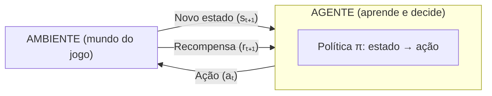
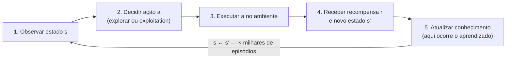
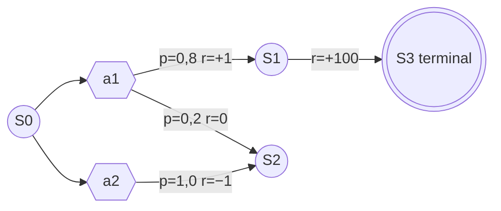

# Capítulo 12 — Aprendizagem por Reforço

## Introdução

Até este ponto da apostila, toda "inteligência" que construímos tinha um endereço claro: **a cabeça de um projetista**. Quando um guarda de *Halo* decide procurar cobertura, quem "decidiu" isso, na verdade, foi o designer que escreveu a regra; quando um NPC de *F.E.A.R.* flanqueia o jogador, quem planejou o flanqueamento foi o programador que montou o sistema de GOAP e as ações disponíveis. A máquina executa — com competência, às vezes com um resultado que parece espontâneo —, mas **não descobre**. O conhecimento é transferido de humanos para o código antes de o jogo rodar, e a IA apenas o aplica.

Neste capítulo, invertemos essa relação. A **Aprendizagem por Reforço** (em inglês, *Reinforcement Learning*, ou **RL**) é a família de técnicas em que o agente **aprende a agir por conta própria**, a partir da **interação com o ambiente**. Ninguém lhe diz qual é a ação correta em cada situação; em vez disso, o agente **experimenta** ações, **observa as consequências** e recebe um sinal numérico de **recompensa** que indica se aquilo foi bom ou ruim. Com o tempo, ajustando seu comportamento para acumular o máximo de recompensa possível, ele **descobre sozinho** uma boa estratégia — sem que ela tenha sido programada explicitamente. É a diferença entre ensinar alguém a andar de bicicleta desenhando um fluxograma de instruções e simplesmente deixá-lo pedalar, cair, corrigir e, por fim, aprender.

Fiéis à estrutura da apostila, partimos do **problema** de design — comportamentos que a equipe não consegue programar à mão — e da distinção fundamental entre **programar** e **aprender**. Construímos, com cuidado, os **conceitos** (agente, ambiente, estado, ação, recompensa, episódio, política, retorno acumulado e o dilema exploração/*exploitation*), formalizamos o cenário com os **Processos de Decisão de Markov (MDP)**, apresentamos as **funções valor** e, sobre tudo isso, o algoritmo central do capítulo: o **Q-Learning**, detalhado passo a passo. Como **aprofundamento**, veremos o **Deep Reinforcement Learning** e o DQN. Aterrissamos em **exemplos**, **aplicações**, **ferramentas** (com destaque para o **Unity ML-Agents**), **estudos de caso** documentados e uma discussão crítica de **vantagens e limitações** — sempre comparando com as técnicas baseadas em regras das Partes anteriores.

> 🕰️ **Contexto Histórico**
> A Aprendizagem por Reforço tem raízes que precedem em muito os jogos digitais. Suas origens estão em duas correntes distintas que convergiram: de um lado, a **psicologia comportamental** — os estudos de condicionamento de Edward Thorndike (a "lei do efeito", 1911) e de B. F. Skinner, segundo os quais comportamentos seguidos de consequências satisfatórias tendem a se repetir; de outro, o **controle ótimo** e a **programação dinâmica**, formalizados por **Richard Bellman** nos anos 1950, cuja célebre *equação de Bellman* é ainda hoje o coração matemático do campo. A síntese moderna veio nas décadas de 1980 e 1990, sobretudo no trabalho de **Richard Sutton** e **Andrew Barto**, cujo livro *Reinforcement Learning: An Introduction* se tornou a referência canônica. O algoritmo **Q-Learning** foi proposto por **Christopher Watkins** em 1989. O marco que projetou o RL ao grande público, porém, veio muito depois: em 2013–2015, a **DeepMind** mostrou um agente que aprendia a jogar dezenas de jogos do Atari 2600 **apenas olhando os pixels da tela e a pontuação** — o **DQN** —, e em 2016 o **AlphaGo** derrotou um dos maiores jogadores de Go do mundo, combinando RL com a busca em árvore que estudamos no Capítulo 11. De Skinner a AlphaGo, a ideia central nunca mudou: aprender **pela consequência das próprias ações**.

---

## 12.1 O problema: comportamentos que a equipe não consegue programar à mão

Comecemos, como sempre, pelo problema concreto — e resistamos à tentação de apresentar RL como "a técnica mais avançada, logo a melhor". Ela resolve um problema **específico**, e entender exatamente qual é esse problema é o que separa o uso maduro do modismo.

### O que as regras não alcançam

Nas Partes II a V, o comportamento do agente foi sempre **especificado explicitamente**. Alguém sentou, pensou no jogo e escreveu: "se o inimigo estiver a menos de 10 metros e eu tiver munição, atire; senão, recarregue; se a vida estiver baixa, recue". Essa abordagem — que chamamos de **programação explícita** ou **baseada em regras** — funciona esplendidamente na imensa maioria dos casos, e é por isso que domina a indústria. Mas ela tem um pressuposto silencioso: **o projetista precisa saber, de antemão, qual é o comportamento correto** para poder codificá-lo.

Ora, há situações em que esse pressuposto simplesmente não se sustenta. Considere alguns exemplos:

- **O espaço de situações é grande demais para enumerar.** Imagine um jogo de luta com dezenas de golpes, distâncias, alturas, barras de energia e estados de atordoamento. Escrever uma regra para *cada combinação* de circunstância é impraticável — são milhões de casos, e a maioria nem foi antecipada pela equipe.

- **O comportamento "certo" não é conhecido nem pelos humanos.** Em um jogo de estratégia econômica complexo, qual é exatamente a melhor ordem de construção contra um oponente que se adapta? Frequentemente **nem os melhores jogadores humanos sabem formular a regra** — eles têm intuição, não um fluxograma. Se o humano não consegue verbalizar a regra, ele não consegue programá-la.

- **O ambiente muda e o comportamento precisa se ajustar.** Um NPC que deveria ficar mais desafiador conforme aprende os hábitos de um jogador específico não pode ter todas as respostas fixadas em tempo de projeto; ele precisaria **adaptar-se durante o uso**.

- **Ajuste manual fino é caro e frágil.** Mesmo quando as regras existem, calibrar seus muitos parâmetros (limiares, pesos, prioridades) à mão é um trabalho tedioso, e cada mudança no jogo obriga a recalibrar tudo.

Nesses casos, a pergunta de design deixa de ser "*qual regra eu escrevo?*" e passa a ser "*como faço a máquina descobrir a regra?*". É exatamente aqui que a Aprendizagem por Reforço entra.

> 🎮 **Na Prática**
> Antes de qualquer entusiasmo, guarde este princípio de engenharia: **se você consegue programar o comportamento com uma FSM ou uma behavior tree, quase sempre deve fazê-lo.** RL só compensa quando programar à mão é genuinamente inviável ou proibitivamente caro. Um inimigo que patrulha, persegue e atira **não** precisa aprender nada — uma máquina de estados resolve com um décimo do esforço, total previsibilidade e nenhum custo de treinamento. Usar RL onde regras bastariam é o erro mais comum de quem acaba de descobrir o tema.

### Programar *versus* aprender pela interação

A distinção central deste capítulo pode ser resumida em duas maneiras opostas de fazer um agente se comportar bem:

**Sistema programado explicitamente.** O conhecimento vem de **fora** e **antes**: um humano analisa o problema, decide o que o agente deve fazer em cada situação e escreve isso como regras, estados ou uma árvore. O agente, em execução, apenas **consulta** esse conhecimento fixo. Se o projetista errou ou não previu um caso, o agente erra também — ele não tem como corrigir a si próprio.

**Sistema que aprende pela interação.** O conhecimento vem de **dentro** e **durante**: o agente começa sabendo pouco ou nada, **age** no ambiente, **observa** o que acontece e recebe **recompensas** que sinalizam sucesso ou fracasso. Ajustando-se para colher mais recompensa, ele **constrói** por conta própria a sua estratégia. Ninguém lhe forneceu a resposta certa; ele a **encontrou** experimentando.

A palavra decisiva é *interação*. No aprendizado por reforço, o agente não recebe um "gabarito" com a ação correta para cada situação — ele recebe apenas um retorno avaliativo (recompensa) depois de agir, e precisa inferir, a partir dessa experiência acumulada, o que fazer.

> ⚠️ **Atenção — RL não é aprendizado supervisionado**
> É crucial não confundir aprendizado por reforço com **aprendizado supervisionado**, a forma de aprendizado de máquina mais conhecida. No aprendizado **supervisionado**, o sistema recebe um conjunto de exemplos **já rotulados com a resposta certa** ("esta imagem é um gato", "aquela é um cachorro") e aprende a reproduzir esses rótulos. Existe um professor que fornece a resposta correta para cada entrada. No aprendizado **por reforço**, **não há gabarito**: ninguém diz ao agente qual era a ação certa em cada momento; há apenas um sinal de recompensa, muitas vezes **esparso e atrasado** (a vitória só vem no fim da partida, depois de centenas de decisões). O agente precisa descobrir **sozinho** quais das suas muitas ações foram responsáveis pelo bom (ou mau) resultado — um problema conhecido como *atribuição de crédito*, que não existe no aprendizado supervisionado. Resumindo: no supervisionado aprende-se **a resposta certa**; no reforço aprende-se **a agir bem**, guiado apenas por recompensas.

### Exemplos de jogos onde RL se torna interessante

Para situar o problema, vale antecipar tipos de jogo em que o aprendizado por interação é, ao menos em tese, uma abordagem atraente (voltaremos a eles em detalhe na Seção 12.8):

- **Jogos com controle motor complexo.** Fazer uma criatura de físicas articuladas (um bípede, um veículo com suspensão, um polvo) aprender a **se locomover** sem que ninguém anime cada movimento à mão. O comportamento "certo" de cada junta é difícil de programar, mas fácil de *recompensar* ("avançou para frente = bom").

- **Jogos de estratégia e tabuleiro de alta complexidade.** Go, xadrez, jogos de cartas colecionáveis — domínios onde a boa jogada é sutil e onde agentes treinados por RL alcançaram nível sobre-humano (AlphaGo/AlphaZero).

- **Ajuste dinâmico de dificuldade e comportamento adaptativo.** NPCs que, em tese, se ajustam ao estilo de um jogador ao longo do tempo.

- **Ferramenta de *design*, e não de tempo de execução.** Um uso frequentemente subestimado: treinar agentes por RL **durante o desenvolvimento**, para testar níveis automaticamente, encontrar exploits, balancear o jogo ou gerar comportamentos de referência — e depois, muitas vezes, **destilar** o resultado em algo mais barato e controlável para o produto final.

Fixado o problema, precisamos construir o vocabulário. Nenhum algoritmo será apresentado antes que seus pré-requisitos conceituais estejam no lugar.

---

## 12.2 Fundamentos: agente, ambiente, estado, ação, recompensa

A Aprendizagem por Reforço tem um vocabulário próprio, pequeno mas preciso. Cada termo será definido **antes** de ser usado, e a ordem de apresentação respeita a dependência entre os conceitos. Muitos deles já apareceram na Parte I (agente, ambiente, o ciclo *Sentir–Pensar–Agir*); aqui eles reaparecem com um significado técnico afiado.

### Agente e ambiente

O **agente** é a entidade que **aprende e decide** — no nosso contexto, o "cérebro" do NPC, da criatura ou do jogador artificial. É ele quem escolhe as ações e quem, ao final, terá aprendido uma estratégia.

O **ambiente** é **tudo o que está fora do agente** e com que ele interage: o mundo do jogo, suas regras, sua física, os outros personagens, o tabuleiro. O ambiente é quem **responde** às ações do agente — mudando de configuração e devolvendo recompensas.

A relação entre os dois é um **laço fechado**: o agente age sobre o ambiente, o ambiente muda e devolve informação ao agente, que age de novo. Reconheça aqui, de forma direta, o velho ciclo **Sentir–Pensar–Agir** da Parte I — o RL é uma teoria matemática precisa desse laço.

> ⚠️ **Atenção**
> A fronteira entre agente e ambiente nem sempre coincide com a fronteira "física" do personagem. Por convenção, **tudo o que o agente não pode controlar arbitrariamente faz parte do ambiente** — inclusive, por exemplo, o próprio corpo do personagem, seus músculos e sua energia, se o agente só pode influenciá-los indiretamente por meio de ações. O agente é estritamente o **tomador de decisão**; todo o resto é ambiente.

### Estado

O **estado** (*state*) é a descrição da situação atual do ambiente **relevante para a decisão** — o "retrato" do mundo no instante em que o agente vai agir. Em um jogo da velha, o estado é a configuração do tabuleiro; em um jogo de plataforma, pode ser a posição e a velocidade do personagem, a posição dos inimigos próximos e o que ele carrega. O conjunto de todos os estados possíveis é chamado de **espaço de estados**.

O estado é a **entrada** da decisão: é olhando para o estado que o agente escolhe o que fazer. A qualidade de um sistema de RL depende enormemente de **quais informações** são incluídas no estado — informação de menos e o agente não consegue decidir bem; informação de mais e o espaço de estados explode, tornando o aprendizado lento ou inviável (voltaremos a isso).

### Ação

A **ação** (*action*) é uma das escolhas que o agente pode fazer em um dado estado — mover-se para a esquerda, pular, atacar, colocar uma peça em determinada casa. O conjunto de ações disponíveis é o **espaço de ações**. As ações são o **único meio** pelo qual o agente influencia o ambiente e, portanto, as recompensas que receberá.

Ações podem ser **discretas** (um número finito de opções: cima, baixo, esquerda, direita) ou **contínuas** (um valor real, como "gire o volante 12,7 graus"). Essa distinção terá consequências: o Q-Learning clássico, que estudaremos, lida naturalmente com ações **discretas**.

### Recompensa

A **recompensa** (*reward*) é um **número** que o ambiente devolve ao agente após cada ação, sinalizando **quão boa foi aquela transição** do ponto de vista do objetivo. Recompensa positiva significa "isso foi bom"; negativa (uma punição), "isso foi ruim"; zero, "indiferente". Em um jogo, recompensas típicas seriam: +1 ao coletar uma moeda, −1 ao levar dano, +100 ao vencer, −100 ao morrer.

A recompensa é o **coração** do RL: ela é a **única** forma pela qual o projetista comunica ao agente *o que se deseja que ele alcance*. Note a sutileza — o projetista não diz **como** fazer (isso o agente descobre), apenas **o que** é bom. Projetar boas recompensas (*reward shaping*) é, por isso, a arte central e a maior fonte de dificuldades práticas do RL.

> ❌ **Erro Comum**
> Confundir **recompensa** com **comportamento**. A recompensa não descreve a ação desejada; descreve o **resultado** desejado. Se você quer que uma criatura aprenda a andar, você **não** recompensa "mover a perna direita" — você recompensa "avançou para frente", e deixa o agente descobrir que mover as pernas alternadamente é o que produz avanço. Recompensar o meio, e não o fim, é um erro clássico: o agente aprende a executar o meio sem alcançar o fim.

> ⚠️ **Atenção — o problema da recompensa mal especificada**
> Como a recompensa é literalmente **tudo o que o agente busca**, uma recompensa mal projetada leva a comportamentos absurdos, porém tecnicamente "corretos". O exemplo célebre e documentado é o do jogo de barco *CoastRunners*: um agente treinado pela OpenAI, recompensado por **pontos** em vez de por **terminar a corrida**, descobriu que podia acumular mais pontos girando em círculos num lago para recolher itens repetidamente, ignorando a corrida por completo — e batendo, pegando fogo e indo na direção errada o tempo todo. O agente maximizou exatamente o que foi pedido; o pedido é que estava errado. Este fenômeno, chamado *reward hacking*, é uma das razões pelas quais RL é traiçoeiro na prática.

### Episódio

Um **episódio** (*episode*) é uma **sequência completa de interação**, do início até um estado terminal — uma "partida", uma "vida", uma "tentativa". Em um jogo da velha, um episódio é uma partida inteira, do tabuleiro vazio até a vitória, derrota ou empate. Em um jogo de plataforma, pode ser da fase começar até o personagem morrer ou chegar ao fim. O aprendizado se dá ao longo de **muitos episódios**: o agente joga milhares ou milhões de partidas, e é a experiência acumulada nelas que produz a estratégia aprendida.

Nem toda tarefa é episódica: algumas são **contínuas** (não terminam nunca, como um agente que controla um sistema indefinidamente). Mas em jogos, a estrutura episódica é a mais comum e a mais intuitiva.

### Política

A **política** (*policy*) é a **estratégia do agente**: uma regra que, dado um estado, diz qual ação tomar. É, literalmente, o **comportamento** do agente — o "cérebro" já treinado. Formalmente, a política é uma função que mapeia estados em ações (ou em probabilidades de ações).

Este é o ponto-chave que conecta tudo: **o objetivo da Aprendizagem por Reforço é encontrar a melhor política possível** — aquela que, seguida a partir de qualquer estado, produz o maior acúmulo de recompensa ao longo do tempo. Quando dizemos que o agente "aprendeu", queremos dizer que ele **descobriu uma boa política**. E note o paralelo com as Partes anteriores: uma FSM, uma behavior tree ou uma árvore de decisão **também** são, no fundo, políticas — mapas de estado para ação. A diferença é que aquelas foram **escritas por um humano**, enquanto a política de RL é **aprendida pela máquina**.

### Exploração *versus* _exploitation_

Chegamos ao dilema mais característico do RL. Suponha que o agente já descobriu uma ação que rende uma recompensa razoável. Ele deve sempre repeti-la (fazer ***exploitation*** do que já conhece) ou deve, de vez em quando, **experimentar** ações diferentes na esperança de encontrar algo ainda melhor (**explorar** o desconhecido)?

- ***Exploitation*** (aproveitamento): usar o conhecimento atual para obter a maior recompensa **agora** — escolher a ação que, pelo que se sabe até o momento, parece a melhor.
- **Exploração** (*exploration*): experimentar ações incertas para **descobrir** se existe algo melhor, aceitando o risco de, no curto prazo, ganhar menos.

O dilema é que **os dois são necessários e conflitam entre si**. Um agente que só faz *exploitation* nunca descobre estratégias melhores do que a primeira coisa razoável que encontrou — fica preso a um comportamento medíocre. Um agente que só explora nunca aproveita o que aprendeu — age ao acaso para sempre. A boa aprendizagem exige **equilibrar** os dois: explorar bastante no início (quando se sabe pouco) e fazer cada vez mais *exploitation* à medida que o conhecimento amadurece.

Uma estratégia simples e onipresente para esse equilíbrio é a **ε-greedy** (épsilon-guloso): na maior parte do tempo (probabilidade 1−ε) o agente faz *exploitation* — escolhe a melhor ação conhecida —, mas com uma pequena probabilidade ε ele explora — escolhe uma ação **aleatória**. Começa-se com ε alto (muita exploração) e o reduz gradualmente ao longo do treino.

> 🎲 **Curiosidade**
> O dilema exploração/*exploitation* não é exclusivo de jogos ou de máquinas — é um problema profundo que aparece em economia, medicina e na vida cotidiana. É o famoso "problema do caça-níqueis de múltiplos braços" (*multi-armed bandit*): diante de várias máquinas caça-níqueis com prêmios desconhecidos, quantas vezes você tenta as menos conhecidas (explorar) antes de se fixar na que parece pagar mais (fazer *exploitation*)? A mesma matemática decide se um serviço de streaming deve recomendar sempre o que você já gosta ou arriscar sugestões novas.

### Retorno acumulado

A recompensa isolada de uma única ação diz pouco — o que importa é o **total ao longo do tempo**. O **retorno acumulado** (ou simplesmente **retorno**, *return*) é a **soma das recompensas** que o agente obtém a partir de um dado momento até o fim do episódio. É essa soma — e não a recompensa imediata — que o agente busca maximizar.

Aqui aparece uma sutileza importante: recompensas **futuras** valem **menos** do que recompensas **imediatas**. Introduz-se, para isso, um **fator de desconto**, representado pela letra grega **γ** (gama), um número entre 0 e 1. A ideia é que uma recompensa recebida daqui a muitos passos é multiplicada por γ elevado ao número de passos, encolhendo seu peso. Assim, o **retorno descontado** dá mais importância ao que está próximo e menos ao que está distante no futuro.

Por que descontar? Por três razões: (1) o futuro é **incerto** — pode nem chegar; (2) matematicamente, o desconto garante que a soma seja **finita** mesmo em tarefas longas; (3) conceitualmente, modela a preferência natural por recompensas mais imediatas. Um γ próximo de 0 produz um agente "imediatista" (só olha a próxima recompensa); um γ próximo de 1 produz um agente "visionário" (planeja longos horizontes). A escolha de γ é uma decisão de projeto que discutiremos ao tratar da função valor.

> 🎮 **Na Prática**
> O fator de desconto γ é um dos parâmetros mais importantes e mais mal-entendidos do RL. Valores comuns em jogos ficam entre 0,9 e 0,99. Um γ = 0,99 significa que o agente "enxerga" dezenas ou centenas de passos à frente — essencial em jogos onde a recompensa (a vitória) só vem no fim. Um γ baixo demais faz o agente ignorar consequências de longo prazo, comportando-se de forma míope; alto demais pode tornar o aprendizado lento e instável. É a mesma tensão "curto prazo × longo prazo" que já vimos no horizonte de busca do Minimax (Capítulo 11).

[DIAGRAMA]
Título: Vocabulário fundamental da Aprendizagem por Reforço
Objetivo pedagógico: Fixar, em um único quadro de referência, todos os conceitos-base e como se relacionam, antes de apresentar qualquer algoritmo.
Descrição detalhada: Um grande retângulo dividido em dois blocos ligados por setas circulares. Bloco esquerdo rotulado "AGENTE" (com um subtítulo "aprende e decide"), contendo uma caixa interna "Política π: estado → ação". Bloco direito rotulado "AMBIENTE" (subtítulo "mundo do jogo"). Do agente para o ambiente, uma seta larga rotulada "Ação (aₜ)". Do ambiente de volta para o agente, DUAS setas paralelas: uma rotulada "Novo estado (sₜ₊₁)" e outra rotulada "Recompensa (rₜ₊₁)". Abaixo do laço, uma linha do tempo horizontal mostrando uma sequência s₀→a₀→r₁→s₁→a₁→r₂→...→sₜ (terminal), com um colchete abarcando toda a sequência rotulado "EPISÓDIO" e, sob ele, a fórmula em texto simples "Retorno = r₁ + γ·r₂ + γ²·r₃ + ... (γ = fator de desconto)". Em um canto, uma pequena legenda de balança com "Explorar ↔ Exploitation" indicando o dilema na escolha da ação.
Elementos obrigatórios: os rótulos agente, ambiente, ação, estado, recompensa, política, episódio, retorno, fator de desconto e o dilema explorar/*exploitation*; o laço fechado agente↔ambiente; a linha do tempo de um episódio.


[/DIAGRAMA]

---

## 12.3 Processo de Aprendizagem

Com o vocabulário no lugar, podemos descrever o **ciclo de aprendizagem** — como, concretamente, o agente transforma experiência em conhecimento. O processo é iterativo e se repete a cada passo de interação, ao longo de muitos episódios.

### O ciclo completo

O aprendizado por reforço acontece em um laço de cinco etapas que se repetem indefinidamente:

1. **Observação.** No estado atual *s*, o agente **observa** a situação do ambiente — obtém a descrição do estado que servirá de base para a decisão.

2. **Tomada de decisão.** Com base no estado observado e na sua política atual (ainda imperfeita), o agente **escolhe uma ação** *a*. Aqui entra o dilema exploração/*exploitation*: às vezes ele escolhe a melhor ação conhecida, às vezes experimenta.

3. **Interação com o ambiente.** O agente **executa** a ação. O ambiente responde: transita para um novo estado *s′* e devolve uma **recompensa** *r*.

4. **Recompensa (avaliação).** O agente **recebe** a recompensa *r* e o novo estado *s′*. Essa dupla "(o que fiz, o que ganhei, onde fui parar)" é a **experiência** — a matéria-prima do aprendizado.

5. **Atualização do conhecimento.** O agente **ajusta** sua estimativa sobre a qualidade de ter tomado aquela ação naquele estado, com base na recompensa recebida e no valor esperado do novo estado. É neste passo que o "aprendizado" de fato ocorre — a experiência modifica o comportamento futuro.

O agente então repete o ciclo a partir do novo estado *s′*, e assim por diante, até o episódio terminar. Um novo episódio começa, e o conhecimento **acumulado** dos episódios anteriores é preservado — é por isso que, ao longo de milhares de episódios, um comportamento inicialmente aleatório vai se refinando em uma estratégia competente.

> 🎮 **Na Prática**
> A quantidade de repetições necessárias costuma chocar quem vem da programação baseada em regras. Enquanto uma FSM "funciona" na primeira execução, um agente de RL pode precisar de **milhões** de passos de interação para aprender uma tarefa modesta. É por isso que quase todo RL de jogos é treinado em **simulação acelerada** — muitas cópias do jogo rodando em paralelo, muito mais rápido que o tempo real, às vezes por horas ou dias. O agente "vive" o equivalente a anos de jogo antes de ficar bom.

[DIAGRAMA]
Título: O ciclo de aprendizagem por reforço
Objetivo pedagógico: Mostrar o laço iterativo observação → decisão → ação → recompensa → atualização como um processo cíclico contínuo.
Descrição detalhada: Um diagrama circular com cinco nós dispostos em círculo, ligados por setas no sentido horário, formando um laço fechado. Nó 1 (topo): "Observar estado s". Nó 2: "Decidir ação a (explorar ou fazer exploitation)". Nó 3: "Executar a no ambiente". Nó 4: "Receber recompensa r e novo estado s′". Nó 5: "Atualizar conhecimento (valor da ação)". A seta do nó 5 retorna ao nó 1, agora com "s ← s′", fechando o ciclo. Ao lado do círculo, uma seta externa grande rotulada "× milhares de episódios" indicando a repetição em larga escala. Em destaque, o nó 5 deve ter uma cor diferente, com a legenda "aqui ocorre o aprendizado".
Elementos obrigatórios: os cinco passos nomeados; o sentido cíclico; a substituição s ← s′; a indicação de repetição massiva; o destaque para o passo de atualização como o momento do aprendizado.


[/DIAGRAMA]

---

## 12.4 Processos de Decisão de Markov (MDP)

Descrevemos o ciclo de aprendizagem de forma intuitiva. Para que algoritmos como o Q-Learning funcionem e para que possamos falar em "política ótima" com rigor, precisamos de um **modelo matemático** do problema. Esse modelo é o **Processo de Decisão de Markov** (*Markov Decision Process*, **MDP**) — a base formal de praticamente toda a Aprendizagem por Reforço. Manteremos o tratamento **conceitual**, evitando formalismo excessivo: o objetivo é entender *o que* um MDP captura e *por que* ele é a fundação do RL.

### Os componentes de um MDP

Um MDP é, essencialmente, uma formalização exata do laço agente–ambiente. Ele é definido por quatro ingredientes, três dos quais já conhecemos:

- **Estados** — o conjunto de todas as situações possíveis do ambiente (o espaço de estados).
- **Ações** — o conjunto de escolhas disponíveis ao agente em cada estado.
- **Transições** — as regras que dizem, dado um estado e uma ação, **para qual estado o ambiente vai**. Em muitos jogos, as transições são **estocásticas** (probabilísticas): a mesma ação no mesmo estado pode levar a estados diferentes, com certas probabilidades (pense em um ataque que às vezes acerta e às vezes erra). Em jogos determinísticos, uma ação sempre leva ao mesmo estado.
- **Recompensas** — o número que o ambiente devolve em cada transição, como já definimos.

A esses quatro, somam-se dois conceitos que já discutimos e que completam o quadro: a **política** (o que o agente faz) e a **função valor** (quão bom é um estado, tema da próxima seção). E o fator de desconto **γ**, que pondera o futuro.

### A propriedade de Markov

O nome "Markov" vem de uma hipótese específica e importante — a **propriedade de Markov**:

> O futuro depende **apenas do estado presente**, não de toda a história que levou até ele.

Em outras palavras, o estado atual **resume tudo o que importa** para decidir o que fazer a seguir. Para escolher a próxima jogada no xadrez, basta olhar a posição **atual** das peças; não importa a ordem de lances que produziu aquela posição. O estado é uma "fotografia suficiente" do presente — dado o estado atual e a ação, o próximo estado e a recompensa não dependem de mais nada do passado.

Essa propriedade é o que torna o problema **tratável**: se o agente precisasse considerar toda a história de tudo o que já aconteceu, o número de "situações distintas" seria astronômico e o aprendizado impossível. A propriedade de Markov permite ao agente raciocinar apenas sobre o estado presente.

> ⚠️ **Atenção**
> A propriedade de Markov é uma **hipótese de projeto**, não um fato garantido — e ela impõe uma responsabilidade sobre quem define o estado. O estado precisa conter informação **suficiente** para que o futuro dependa só dele. Se, para decidir bem, o agente precisasse saber "de que direção o inimigo veio nos últimos 3 segundos" e essa informação **não** estiver no estado, então o problema **não é markoviano** em relação a esse estado, e o aprendizado será prejudicado. A solução prática é enriquecer o estado (por exemplo, incluir velocidades além de posições, ou um histórico curto). Projetar um bom estado é, em grande parte, **garantir que ele seja markoviano o suficiente**.

> 🎲 **Curiosidade**
> A cadeia de Markov — o parente sem decisões do MDP — foi criada pelo matemático russo **Andrei Markov** no início do século XX, originalmente para analisar padrões estatísticos em **poesia**: ele estudou a sequência de vogais e consoantes no romance *Eugênio Onéguin*, de Púchkin. Um século depois, a mesma ideia de "o próximo estado depende só do atual" sustenta desde a IA de jogos até os modelos de linguagem e o algoritmo original de ranqueamento do Google.

### Por que o MDP é a base do RL

O MDP é a fundação da Aprendizagem por Reforço porque ele **define com precisão o que significa "resolver" o problema**. Uma vez que o jogo esteja modelado como um MDP, "aprender a jogar bem" ganha um significado matemático exato: encontrar a **política ótima** — a política que maximiza o **retorno esperado descontado** a partir de qualquer estado. Toda a teoria de RL — funções valor, equação de Bellman, Q-Learning — é, no fundo, um conjunto de métodos para **encontrar (ou aproximar) a política ótima de um MDP**.

Há uma distinção prática que vale marcar. Se o agente **conhece** as transições e recompensas do MDP (isto é, tem um "modelo" completo do jogo), ele pode calcular a política ótima por **programação dinâmica** — os métodos de Bellman, que resolvem o MDP "no papel", sem precisar jogar. Mas o cenário típico da Aprendizagem por Reforço é o oposto: o agente **não conhece** o MDP de antemão — não sabe as probabilidades de transição nem onde estão as recompensas. Ele precisa **descobri-las jogando**. É por isso que o RL é frequentemente descrito como "**programação dinâmica sem o modelo**": resolver o MDP **por experiência**, e não por cálculo prévio. O Q-Learning, que veremos, é exatamente um método assim — ele aprende a agir otimamente **sem nunca conhecer explicitamente** as transições do ambiente.

[DIAGRAMA]
Título: Estrutura de um Processo de Decisão de Markov (MDP)
Objetivo pedagógico: Visualizar estados, ações, transições probabilísticas e recompensas como um grafo, e ilustrar a propriedade de Markov.
Descrição detalhada: Um pequeno grafo com três ou quatro estados representados por círculos (S0, S1, S2, S3), sendo S3 marcado como terminal (círculo duplo). De S0 saem duas ações, representadas por pequenos nós quadrados rotulados "a1" e "a2". De cada nó de ação partem setas para estados de destino, rotuladas com probabilidade e recompensa — por exemplo, de "a1" duas setas: "p=0,8; r=+1 → S1" e "p=0,2; r=0 → S2" (ilustrando transição estocástica); de "a2" uma seta "p=1,0; r=−1 → S2". De S1 uma ação leva a S3 com "r=+100" (recompensa terminal grande). Um balão de destaque sobre S1 diz: "Propriedade de Markov: o que acontece a partir daqui depende SÓ de S1, não de como chegamos até ele". Legenda explicando que círculos = estados, quadrados = ações, setas = transições com probabilidade e recompensa.
Elementos obrigatórios: estados (incluindo um terminal), ações, transições com probabilidade e recompensa, ao menos uma transição estocástica (probabilidades somando 1), e a anotação da propriedade de Markov.


[/DIAGRAMA]

---

## 12.5 Função Valor

Recompensa é o sinal **imediato**; retorno é a **soma futura**. Mas o agente, ao decidir, precisa de algo que estime, para cada situação, **quão promissora ela é a longo prazo** — não só a recompensa do próximo passo, mas todo o bem que tende a vir depois. Esse é o papel da **função valor**, o conceito que faz a ponte entre "recompensas soltas" e "boas decisões".

### Valor de estado

O **valor de um estado** *s* — escrito **V(s)** — é o **retorno esperado** que o agente obterá **se estiver em *s* e seguir sua política dali em diante**. Em palavras simples: *quão bom é estar aqui?*. Um estado tem valor alto se, a partir dele, tende-se a colher muita recompensa no futuro (mesmo que a recompensa **imediata** ali seja zero); tem valor baixo se conduz a maus desfechos.

A distinção entre **recompensa** e **valor** é sutil e absolutamente central:

- A **recompensa** mede o bem **imediato** de uma transição.
- O **valor** mede o bem **total e futuro** esperado a partir de um estado.

Um exemplo esclarece. Em um jogo, entrar em uma sala vazia pode dar recompensa **zero** (nada acontece ali), mas ter valor **alto** se aquela sala é o único caminho para o tesouro. Inversamente, pegar um item que dá +10 de recompensa **imediata** pode ter valor **baixo** se aquele item só aparece em um beco sem saída cercado de armadilhas mortais. Boas decisões seguem o **valor**, não a recompensa imediata — e é por isso que estimar o valor corretamente é o objetivo técnico do aprendizado.

> ❌ **Erro Comum**
> Guiar o agente pela recompensa imediata em vez de pelo valor. Um agente míope, que só persegue a próxima recompensa, cai em todas as armadilhas de "isca": prêmios pequenos e imediatos que levam a desastres futuros. A função valor existe justamente para evitar isso — ela "propaga" o valor dos bons desfechos futuros de volta para os estados que conduzem a eles. É o mesmo princípio do mapa de influência (Capítulo 10), onde o valor de uma boa posição se espalhava pelo terreno ao redor.

### Valor de ação

Mais útil ainda para decidir é o **valor de ação** — escrito **Q(s, a)** —, que responde a uma pergunta mais precisa: *quão bom é tomar a ação **a** estando no estado **s**, e depois seguir a política?*. Enquanto V(s) avalia **estar** em um estado, Q(s, a) avalia **fazer** algo específico naquele estado.

A vantagem prática do Q é enorme e será a base do algoritmo da próxima seção: **se o agente conhece Q(s, a) para todas as ações possíveis em um estado, decidir bem é trivial** — basta escolher a ação com o **maior Q**. Não é preciso saber nada mais sobre o mundo, nem simular o futuro: o valor de ação já **resume** todo o retorno futuro esperado de cada escolha. É por isso que muitos algoritmos de RL, incluindo o Q-Learning, focam em aprender a **função Q**: ela transforma o difícil problema "como agir bem?" no problema simples "qual ação tem o maior Q?".

### Retorno esperado e desconto temporal

Tanto V quanto Q são definidos em termos de **retorno esperado**. A palavra **esperado** é importante: como o ambiente pode ser estocástico (a mesma ação pode dar resultados diferentes), o valor não é o retorno de uma execução específica, mas a **média** que se obteria repetindo a situação muitas vezes. O agente busca maximizar essa média, não um golpe de sorte pontual.

E o **desconto temporal**, via fator γ, permeia tudo: no cálculo do valor, recompensas distantes entram multiplicadas por γ elevado ao número de passos, valendo menos que recompensas próximas. Assim, γ controla o "horizonte de planejamento" embutido na função valor — quanto o agente se importa com o futuro distante ao avaliar um estado ou uma ação.

### Como o valor influencia a decisão

Juntando as peças: o agente **decide** olhando os valores de ação. Em cada estado, ele tende a escolher a ação de maior Q (*exploitation*), ocasionalmente experimentando outras (exploração). **Aprender**, portanto, é **estimar corretamente os valores Q** — e é exatamente isso que o Q-Learning faz. Uma vez que os valores estejam corretos, a política ótima **emerge automaticamente**: "em cada estado, faça a ação de maior valor". Toda a dificuldade do RL se concentra, então, em uma única tarefa: **descobrir os valores certos a partir da experiência**. É a essa tarefa que dedicamos a próxima seção.

> 🏭 **Na Indústria**
> A ideia de "função valor" — estimar quão boa é uma situação — não é exclusividade do RL; ela é, na verdade, uma das ideias mais reaproveitadas de toda a IA de jogos. A **função de avaliação** do Minimax (Capítulo 11) é uma função valor de estado escrita à mão. O **mapa de influência** (Capítulo 10) é uma função valor espacial. A diferença do RL é apenas **de onde vem o valor**: em vez de ser projetado por um humano, ele é **aprendido pela experiência**. Reconhecer essa continuidade ajuda a ver o RL não como algo alienígena, mas como a versão *aprendida* de uma ideia que a apostila usa desde a Parte IV.

---

## 12.6 Q-Learning

Chegamos ao algoritmo central do capítulo. O **Q-Learning**, proposto por Christopher Watkins em 1989, é o método mais didático e influente da Aprendizagem por Reforço — e o ponto em que toda a teoria das seções anteriores se converte em um procedimento concreto que um computador pode executar. Ele aprende, por pura experiência e **sem conhecer o modelo do ambiente**, os valores de ação Q(s, a) que definem uma política ótima. Vamos construí-lo peça por peça.

### A tabela Q

A ideia mais simples para representar a função Q(s, a) é uma **tabela** — a **tabela Q** (ou *Q-table*). Imagine uma grande planilha em que:

- cada **linha** corresponde a um **estado** possível;
- cada **coluna** corresponde a uma **ação** possível;
- cada **célula** guarda o valor **Q(s, a)** estimado — o retorno futuro esperado de tomar a ação daquela coluna no estado daquela linha.

No início, o agente **não sabe nada**: a tabela é inicializada com zeros (ou valores arbitrários). À medida que joga e recebe recompensas, ele vai **preenchendo e corrigindo** essas células, de modo que, ao final do treino, cada célula contenha uma boa estimativa do valor real. Decidir, então, torna-se trivial: no estado *s*, o agente olha a linha correspondente e escolhe a ação da célula com **maior valor**.

Considere um exemplo minúsculo para tornar isso concreto. Um agente em um pequeno labirinto em grade, onde cada célula do mapa é um estado e as ações são {Norte, Sul, Leste, Oeste}. A tabela Q teria uma linha por célula do labirinto e quatro colunas. A célula (Estado = "posição ao lado da saída", Ação = "mover para a saída") acabaria com um valor alto; a célula (Estado = "posição ao lado de uma armadilha", Ação = "mover para a armadilha") acabaria com valor bastante negativo.

> ⚠️ **Atenção**
> A tabela Q só é viável quando o número de estados e ações é **pequeno o suficiente** para caber em memória e para ser visitado muitas vezes durante o treino. Um labirinto de 100 células com 4 ações precisa de uma tabela de 400 células — trivial. Mas um jogo cujo estado inclua posições contínuas, muitos inimigos e inventário pode ter **bilhões ou infinitos** estados — e aí a tabela se torna impossível. Essa é exatamente a limitação que o **Deep Reinforcement Learning** (Seção 12.7) vem resolver, substituindo a tabela por uma rede neural. Guarde isto: **a tabela Q é a versão didática e limitada; a rede neural é a versão escalável.**

### A atualização dos valores e a equação de Bellman

O coração do Q-Learning é a **regra de atualização** — a fórmula que, a cada experiência, corrige uma célula da tabela. Ela se apoia em uma ideia profunda, a **equação de Bellman**, que expressa uma relação de consistência que os valores corretos devem satisfazer:

> O valor de tomar uma ação agora deve ser igual à **recompensa imediata** que ela dá **mais** o **valor descontado do melhor que se pode fazer a seguir**.

Em palavras, o valor de (s, a) "olha um passo à frente": ganho agora + o melhor futuro possível a partir de onde essa ação me deixou. Escrevendo com os símbolos que já conhecemos, a regra de atualização do Q-Learning é:

```text
Q(s, a) ← Q(s, a) + α · [ r + γ · maxₐ′ Q(s′, a′) − Q(s, a) ]
```

À primeira vista assusta, mas cada pedaço já nos é familiar. Vamos dissecá-la:

- **Q(s, a)** — o valor **atual** estimado para a ação *a* no estado *s* (o que a tabela diz hoje).
- **r** — a **recompensa imediata** que o agente acabou de receber ao executar *a*.
- **s′** — o **novo estado** para onde o agente foi.
- **maxₐ′ Q(s′, a′)** — o valor da **melhor ação disponível** no novo estado *s′*. É a estimativa do "melhor futuro a partir de agora". Note o **max**: o Q-Learning assume que, dali em diante, o agente agirá **otimamente**.
- **γ** — o **fator de desconto**, que reduz o peso desse futuro.
- **α** (alfa) — a **taxa de aprendizagem** (adiante).
- O termo entre colchetes, **[ r + γ · maxₐ′ Q(s′, a′) − Q(s, a) ]**, é o **erro de diferença temporal** (*TD error*): a diferença entre o que o agente **agora estima** que a ação valia (r + futuro) e o que ele **achava** que ela valia (o Q antigo). Se essa diferença for positiva, a ação foi **melhor** do que se pensava, e seu valor **sobe**; se negativa, foi **pior**, e o valor **desce**.

A regra, portanto, diz algo muito intuitivo: **ajuste sua estimativa antiga na direção da nova evidência, um pouco de cada vez**. O "quanto" desse ajuste é controlado por α.

### A taxa de aprendizagem (α)

A **taxa de aprendizagem** **α** (alfa), um número entre 0 e 1, controla **o tamanho do passo** de cada correção:

- α **próximo de 1**: o agente **confia muito** na experiência mais recente e sobrescreve rapidamente sua estimativa antiga. Aprende rápido, mas fica **instável** — uma única experiência atípica (por azar ou por acaso do ambiente) sacode demais os valores.
- α **próximo de 0**: o agente **quase ignora** cada nova experiência, mudando os valores muito devagar. É **estável**, mas aprende lentíssimo.

Na prática, escolhe-se um α moderado (por exemplo, 0,1) ou faz-se α **diminuir ao longo do tempo** — grande no início (quando as estimativas são ruins e vale a pena mudá-las bastante) e pequeno no fim (quando já estão boas e só precisam de ajustes finos). Note o paralelo estrutural com a taxa de mutação e o resfriamento que veremos no Capítulo 13: quase todo método de otimização e aprendizado tem um parâmetro que regula "quão agressivamente eu mudo".

### O fator de desconto (γ) no Q-Learning

Já discutimos γ na Seção 12.2; no Q-Learning ele aparece explicitamente multiplicando o "melhor futuro" na regra de atualização. Seu efeito é o mesmo: γ alto (perto de 1) faz o agente valorizar recompensas distantes, propagando o valor da vitória final por uma longa cadeia de estados; γ baixo torna o agente imediatista. Em um labirinto onde a única recompensa é chegar à saída, é justamente o γ que faz o valor da saída "escorrer" para trás, célula a célula, até que o caminho inteiro fique marcado com valores crescentes rumo ao objetivo.

### Q-Learning passo a passo: um exemplo completo

Nada fixa o algoritmo como acompanhá-lo em ação. Considere um agente em uma trilha linear de cinco posições, S1 a S5, onde S5 é a saída (recompensa +10) e as demais dão recompensa 0. As ações são apenas "Esquerda" e "Direita". Usaremos **α = 0,5** e **γ = 0,9**, e a tabela Q começa **toda zerada**.

**Situação inicial (tabela Q = 0 em todas as células).** O agente não sabe nada; move-se essencialmente ao acaso (exploração).

**Primeiro aprendizado relevante — o agente, em S4, escolhe "Direita" e alcança S5.**
- Estado s = S4, ação a = Direita, recompensa r = +10, novo estado s′ = S5 (terminal, então o "melhor futuro" max Q(s′,·) = 0).
- Aplicando a regra:
  `Q(S4, Direita) ← 0 + 0,5 · [ 10 + 0,9 · 0 − 0 ] = 0,5 · 10 = 5,0`
- A célula Q(S4, Direita) passa de 0 para **5,0**. O agente aprendeu que "ir para a direita a partir de S4 é bom".

**Segundo episódio — o agente, em S3, escolhe "Direita" e vai para S4.**
- s = S3, a = Direita, r = 0, s′ = S4. Agora o "melhor futuro" **não** é mais zero: max Q(S4, ·) = 5,0 (aprendido antes!).
- `Q(S3, Direita) ← 0 + 0,5 · [ 0 + 0,9 · 5,0 − 0 ] = 0,5 · 4,5 = 2,25`
- A célula Q(S3, Direita) passa a **2,25**. Repare no fenômeno crucial: **o valor da saída começou a "escorrer para trás"**. Mesmo sem receber recompensa em S3, o agente aprendeu que ir para a direita ali tem valor, **porque leva a um estado valioso**. É o desconto γ propagando o valor do objetivo pela cadeia de estados.

**Terceiro episódio — de novo em S4, "Direita" para S5.**
- `Q(S4, Direita) ← 5,0 + 0,5 · [ 10 + 0 − 5,0 ] = 5,0 + 2,5 = 7,5`
- O valor **refina-se** em direção ao valor verdadeiro. Com mais visitas, Q(S4, Direita) convergiria para 10, Q(S3, Direita) para 9, Q(S2, Direita) para 8,1, e assim por diante — uma trilha de valores crescentes apontando para a saída.

Depois de muitos episódios, a tabela Q codifica a política ótima: **em cada estado, "Direita" tem valor maior que "Esquerda"**, então o agente, fazendo *exploitation*, caminha direto para a saída. Ele **descobriu o caminho** sem que ninguém jamais lhe dissesse "vá para a direita" — apenas pela recompensa em S5 e pela propagação de Bellman.

> ✅ **Boa Prática**
> Ao estudar (ou depurar) Q-Learning, sempre pergunte: "o valor do objetivo já teve tempo de **escorrer para trás** até os estados iniciais?". No começo do treino, apenas as células **imediatamente** vizinhas da recompensa têm valor; a informação se propaga um passo por episódio (aproximadamente). Por isso tarefas com recompensa muito **distante** e **esparsa** (a vitória a centenas de passos, e nada no meio) aprendem devagar — o valor demora a percorrer toda a cadeia. Reconhecer isso explica muitos "fracassos" de RL que são, na verdade, só falta de tempo de propagação ou recompensas mal distribuídas.

> 🎲 **Curiosidade**
> O Q-Learning tem uma propriedade teórica notável: é um método **off-policy** ("fora da política"). Isso significa que ele aprende os valores da política **ótima** mesmo enquanto o agente se comporta de forma **exploratória** (às vezes aleatória). Em outras palavras, o agente pode passar o treino inteiro fazendo bobagens exploratórias e, ainda assim, a tabela Q converge para os valores do comportamento **perfeito** — porque o `max` na regra de atualização sempre considera a melhor ação possível, não a que foi de fato tomada. É essa separação entre "como eu me comporto para aprender" e "o que eu aprendo" que dá ao Q-Learning boa parte de sua robustez, e prova-se matematicamente que, sob certas condições, ele **converge** para a política ótima.

[DIAGRAMA]
Título: Atualização de uma célula da tabela Q
Objetivo pedagógico: Tornar visual a regra de atualização do Q-Learning e o conceito de "valor escorrendo para trás".
Descrição detalhada: Duas partes. Parte superior: uma tabela Q desenhada como grade, linhas = estados (S1..S5), colunas = ações (Esquerda, Direita). Uma célula específica — (S3, Direita) — está destacada, com uma seta apontando para ela vinda de uma "caixa de cálculo". A caixa de cálculo mostra, em linguagem de blocos: "Novo Q(S3,Dir) = Q antigo + α·[ r + γ·max Q(S4,·) − Q antigo ]", com cada termo rotulado (α = taxa de aprendizagem, r = recompensa imediata, γ = desconto, max Q(S4,·) = melhor valor do próximo estado). Parte inferior: a trilha S1–S2–S3–S4–S5 desenhada como cinco círculos em linha, S5 com uma estrela (+10), e setas curvas para trás mostrando o valor "escorrendo" de S5→S4→S3→S2, com valores decrescentes anotados (10 → 9 → 8,1 → 7,29...), ilustrando o desconto propagando o valor do objetivo pela cadeia.
Elementos obrigatórios: a tabela Q com estados nas linhas e ações nas colunas; a célula destacada e a fórmula de atualização com todos os termos nomeados; a trilha de estados com a recompensa terminal e o "escorrimento" do valor para trás com desconto.
[/DIAGRAMA]

---

## 12.7 Deep Reinforcement Learning *(aprofundamento)*

Esta seção é conteúdo de **aprofundamento**. Ela mostra como o RL escala para problemas grandes, mas **não é o foco do capítulo** — os fundamentos (agente, ambiente, valor, Q-Learning) continuam sendo o essencial. Trate o que segue como uma "vista do topo da montanha": importante para situar-se, mas não o terreno onde caminharemos em detalhe.

### A motivação: quando a tabela não cabe

Vimos que a tabela Q exige uma célula para **cada** par (estado, ação). Isso funciona em labirintos e jogos minúsculos, mas colapsa diante de jogos reais. Considere um agente que aprende a jogar um jogo do Atari **olhando a tela**: o "estado" é a imagem de pixels. O número de imagens possíveis é astronômico — muito maior que o número de átomos no universo. Não há tabela que os armazene, e a esmagadora maioria dos estados nunca seria visitada duas vezes, impossibilitando o preenchimento célula a célula.

O problema é geral: sempre que o espaço de estados é **enorme** ou **contínuo**, a tabela Q é inviável. Precisamos de algo que **generalize** — que, ao ver um estado novo parecido com outros já vistos, **estime** um valor razoável sem precisar tê-lo visitado antes. É exatamente isso que uma **rede neural** faz.

### Aproximação por redes neurais

A ideia do **Deep Reinforcement Learning** (RL Profundo) é **substituir a tabela Q por uma rede neural** que **aproxima** a função Q. Em vez de guardar um valor por célula, a rede recebe a descrição do estado (por exemplo, os pixels da tela) na entrada e **produz na saída** os valores Q estimados para cada ação. A rede não memoriza estados um a um; ela aprende **padrões** — regularidades que permitem estimar o valor de estados nunca vistos por semelhança com os já vistos. É a diferença entre decorar uma tabela de multiplicação inteira e **entender** a operação de multiplicar.

O termo "*deep*" (profundo) vem de **redes neurais profundas** — redes com muitas camadas, capazes de extrair automaticamente características complexas dos dados de entrada (bordas, formas, objetos, numa imagem, por exemplo). Essa capacidade de **aprender a representação** do estado, além de aprender os valores, é o que dá ao RL profundo seu alcance.

> ⚠️ **Atenção**
> Redes neurais são um tema extenso, com fundamentos próprios (neurônios artificiais, camadas, pesos, funções de ativação, retropropagação) que esta apostila **não** desenvolve em profundidade — pertencem a uma disciplina de Aprendizado de Máquina. Aqui, basta a ideia funcional: a rede é uma **caixa que aprende a mapear estados em valores de ação**, ocupando o lugar da tabela Q. Quem quiser se aprofundar deve estudar redes neurais e aprendizado profundo separadamente; para os fins deste capítulo, o conceito de "aproximador de função" é suficiente.

### Deep Q-Network (DQN)

O marco que uniu Q-Learning e redes neurais foi o **Deep Q-Network (DQN)**, apresentado pela **DeepMind** em 2013–2015. O DQN é, em essência, **Q-Learning com uma rede neural profunda no lugar da tabela** — mais alguns truques de engenharia que tornaram o treinamento estável, dos quais dois merecem menção conceitual:

- **Repetição de experiência** (*experience replay*): em vez de aprender só com a experiência mais recente, o agente **guarda** suas experiências passadas em uma memória e as **reutiliza** em lotes aleatórios para treinar a rede. Isso quebra a correlação entre experiências consecutivas e usa cada experiência muitas vezes, tornando o aprendizado mais eficiente e estável.
- **Rede-alvo** (*target network*): uma cópia "congelada" da rede é usada para calcular o "melhor futuro" (o termo max da regra de Bellman), sendo atualizada apenas de tempos em tempos. Isso evita que o alvo do aprendizado se mova junto com a rede que aprende — um problema de instabilidade análogo a tentar acertar um alvo que se desloca à mesma velocidade que você.

O resultado foi histórico: um **único** algoritmo, sem ajustes específicos por jogo, aprendeu a jogar **dezenas de jogos do Atari 2600** apenas a partir dos pixels e da pontuação, atingindo ou superando o nível humano em muitos deles. Foi a demonstração que reacendeu o interesse mundial pela Aprendizagem por Reforço.

### Vantagens e limitações do RL profundo

**Vantagens.** Escala para espaços de estado enormes e contínuos (imagens, sensores ricos); **generaliza** para estados novos; dispensa a engenharia manual de características do estado (a rede as descobre); alcançou resultados sobre-humanos em domínios antes intratáveis (Atari, Go, StarCraft II, Dota 2).

**Limitações.** É **caro** e **faminto por dados**: exige quantidades imensas de interação (milhões a bilhões de passos) e muito poder computacional; é **instável** e sensível a hiperparâmetros (pequenas mudanças arruínam o treino); é uma **caixa-preta** de difícil interpretação e depuração (por que a rede decidiu aquilo? Ninguém sabe ao certo); e o comportamento resultante é difícil de **controlar** e de **garantir** — problemas sérios para um produto comercial que precisa ser previsível e depurável. Essas limitações explicam por que, apesar do brilho acadêmico, o RL profundo permanece **raro** na IA de jogos comerciais em produção.

> 🏭 **Na Indústria**
> O uso mais realista de RL profundo em desenvolvimento de jogos raramente é "colocar um agente que aprende no produto final". É, muito mais frequentemente, uma **ferramenta de desenvolvimento**: treinar agentes para **testar** o jogo automaticamente (encontrar bugs, exploits, sequências que quebram o balanceamento), para gerar **dados** ou comportamentos de referência, ou para validar o *design* de um nível. Depois, o comportamento útil é frequentemente **destilado** em algo mais barato, previsível e controlável — muitas vezes de volta para regras ou uma política simplificada. RL como **martelo de design**, não como cérebro do NPC em tempo de execução.

---

## 12.8 Aplicações em Jogos

Vejamos como a Aprendizagem por Reforço aparece — e onde **não** aparece — em jogos reais. Seguindo a disciplina da apostila, para cada aplicação explicamos **o problema**, **a estratégia** utilizada e **os resultados** obtidos, e distinguimos fatos documentados de análises técnicas.

### Locomoção e controle físico aprendidos

- **O problema.** Animar à mão criaturas com corpos articulados e físicas complexas (bípedes, quadrúpedes, criaturas fantásticas) para que se movam de forma convincente é caro e nem sempre robusto a terrenos variados.
- **A estratégia.** Treinar por RL um controlador que recebe o estado do corpo (posições, velocidades, ângulos das juntas) e produz forças/torques nas juntas, recompensado por "avançar", "manter-se em pé", "seguir uma direção".
- **Os resultados.** Trabalhos acadêmicos e demonstrações (incluindo exemplos oficiais do próprio Unity ML-Agents) mostram criaturas que **aprendem a caminhar, correr e se equilibrar** do zero. Em produção, essa técnica alimenta pesquisas de **animação procedural** e locomoção física, embora jogos comerciais ainda prefiram, na maioria, animação tradicional combinada com física.

### Jogos de tabuleiro e estratégia de nível sobre-humano

- **O problema.** Em Go, xadrez e shogi, o espaço de jogadas é gigantesco e a boa jogada é sutil demais para uma função de avaliação escrita à mão de qualidade sobre-humana.
- **A estratégia.** Combinar RL (aprendizado por **auto-jogo** — o agente joga contra si mesmo milhões de vezes) com busca em árvore (MCTS, Capítulo 11), aprendendo tanto a **função valor** quanto a política que guia a busca.
- **Os resultados.** **AlphaGo** (2016) derrotou o campeão Lee Sedol no Go; **AlphaZero** (2017) atingiu nível sobre-humano em Go, xadrez e shogi **partindo apenas das regras**, sem dados humanos, aprendendo tudo por auto-jogo. São os resultados mais célebres do RL — e a ponte histórica com a busca adversarial da Parte V.

### Agentes competitivos em jogos eletrônicos complexos

- **O problema.** Dominar jogos em tempo real com informação incompleta, horizontes longos e enorme espaço de ações — como *StarCraft II* e *Dota 2* — desafia qualquer abordagem programada à mão.
- **A estratégia.** RL profundo em escala massiva, com auto-jogo, arquiteturas de rede sofisticadas e milhares de anos de jogo simulado.
- **Os resultados (documentados).** O **AlphaStar** (DeepMind) atingiu nível de grão-mestre em *StarCraft II*; o **OpenAI Five** derrotou equipes campeãs de *Dota 2*. Foram **projetos de pesquisa** de custo altíssimo, não recursos embarcados nos jogos comerciais — importante distinção para não superestimar o uso prático.

### Ajuste dinâmico de comportamento e dificuldade

- **O problema.** Criar NPCs que se adaptem ao estilo de cada jogador ao longo do tempo, ou ajustar a dificuldade automaticamente.
- **A estratégia.** Em tese, RL online que ajusta a política conforme o comportamento observado do jogador.
- **Os resultados.** Na prática comercial, isso é **raro** via RL puro; o ajuste dinâmico de dificuldade costuma ser feito com heurísticas simples e sistemas baseados em regras (como o "Diretor de IA", que veremos na Parte VII), muito mais controláveis. É um caso onde a promessa teórica do RL raramente se concretiza no produto.

> ❌ **Erro Comum**
> Ler a lista de feitos acima (AlphaGo, OpenAI Five) e concluir que "RL é como a IA dos jogos modernos funciona". É o oposto: esses são **projetos de pesquisa** que consumiram recursos computacionais colossais para demonstrar capacidades, **não** a IA que roda no seu jogo favorito. O NPC comercial típico continua sendo movido por FSM, behavior trees e GOAP. Confundir a fronteira da pesquisa com a prática de produção é o mal-entendido mais comum sobre RL em jogos.

---

## 12.9 Ferramentas

Seguindo a filosofia da apostila, esta seção é **contextualização**, não tutorial. O objetivo é situar as ferramentas que dão suporte ao RL, sem ensinar menus nem passo a passo.

### Unity ML-Agents

A principal ferramenta de RL no ecossistema Unity é o **ML-Agents Toolkit** (Machine Learning Agents), um pacote **oficial e de código aberto** mantido pela Unity. Sua proposta é permitir que **cenas da própria Unity** sirvam de **ambiente de treinamento** para agentes de aprendizado por reforço (e outras formas de aprendizado). Conceitualmente, o ML-Agents materializa exatamente o vocabulário deste capítulo:

- o desenvolvedor define, em C#, **o que o agente observa** (o estado), **quais ações** ele pode tomar e **como recompensá-lo** (a função de recompensa);
- o motor de treinamento (que roda em Python, usando bibliotecas de aprendizado profundo) conversa com a Unity, coleta a experiência dos agentes na cena e **treina** uma rede neural que implementa a política;
- ao final, a política treinada é **exportada** (via o runtime de inferência da Unity) e passa a controlar o agente dentro do jogo, já sem precisar do treinador.

O ML-Agents implementa algoritmos modernos de RL (como o **PPO — Proximal Policy Optimization** — e o **SAC**), e não o Q-Learning tabular didático que estudamos; mas os **conceitos** que ele expõe (agente, observações, ações, recompensa, episódio, treinamento por interação) são precisamente os deste capítulo. É por isso que dominar os fundamentos **conceituais** é o que capacita alguém a usar a ferramenta com juízo — sem eles, o ML-Agents é uma caixa de botões sem sentido.

> 🎮 **Na Prática**
> O ML-Agents é excelente como **laboratório de aprendizado** e como ferramenta de pesquisa/prototipagem dentro da Unity. Seus exemplos oficiais (criaturas que aprendem a andar, agentes que jogam minijogos, cooperação e competição entre agentes) são um dos melhores caminhos para *ver* RL funcionando. Mas repare: ele é uma ferramenta de **treinamento**, não um "componente de IA" que se arrasta para a cena e funciona pronto como o NavMesh. Treinar um agente exige definir bem estado, ações e recompensa, rodar longos treinamentos e lidar com toda a imprevisibilidade do RL.

### Unity Sentis (inferência de modelos)

Quando o treino termina, é preciso **executar** a rede neural treinada dentro do jogo — o passo de **inferência**. A Unity oferece o **Sentis** (sucessor do antigo Barracuda), um runtime de inferência de redes neurais que roda modelos (em formato aberto, como ONNX) diretamente no motor, em diversas plataformas. No contexto de RL, o Sentis é o componente que faz a **política treinada rodar em tempo de execução** no produto final, sem depender do ambiente de treinamento em Python. Vale a distinção conceitual: **ML-Agents treina**; **Sentis executa** o modelo treinado (e pode executar qualquer rede neural, não só políticas de RL).

### Outras ferramentas amplamente utilizadas

Fora do ecossistema Unity, o RL de pesquisa apoia-se em bibliotecas maduras: **Gymnasium** (antiga *OpenAI Gym*), o padrão para definir ambientes de RL; **Stable-Baselines3** e outras bibliotecas de algoritmos prontos; e os frameworks de aprendizado profundo **PyTorch** e **TensorFlow**, que fornecem as redes neurais subjacentes. No mundo das *engines*, a **Unreal** oferece o **Learning Agents**, uma proposta análoga ao ML-Agents para o seu ecossistema — uma comparação natural: ambos transformam cenas do motor em ambientes de treino de RL, refletindo o reconhecimento, pelos dois maiores motores, de que aprendizado é uma capacidade que vale a pena oferecer, ainda que de nicho.

> ⚠️ **Atenção**
> Nenhuma dessas ferramentas dispensa a compreensão conceitual. Elas automatizam a **mecânica** do treinamento (a matemática das redes, a otimização, a coleta de experiência), mas as decisões que **determinam o sucesso** — o que colocar no estado, quais ações permitir, como moldar a recompensa — continuam sendo **de projeto**, e dependem inteiramente de entender os fundamentos das Seções 12.2 a 12.6. A ferramenta não pensa por você; ela executa bem o que você souber pedir.

---

## 12.10 Vantagens e Limitações

Chega o momento da avaliação crítica — e, fiéis à orientação do capítulo, comparamos sempre com as técnicas **baseadas em regras** das Partes anteriores.

### Vantagens

- **Descobre comportamentos que ninguém sabe programar.** É a vantagem definidora: em domínios onde o comportamento ótimo é desconhecido ou complexo demais para regras (Go, controle motor), o RL pode **encontrar** soluções que superam qualquer coisa escrita à mão.
- **Adapta-se pela experiência.** Em vez de exigir que o projetista antecipe cada situação, o agente ajusta-se ao que **de fato** encontra no ambiente.
- **Otimiza para um objetivo, não para um método.** Basta especificar **o que** se quer (a recompensa); o agente descobre o **como**. Isso pode revelar estratégias criativas e não óbvias.
- **Generaliza (na versão profunda).** Com redes neurais, lida com estados nunca vistos, escalando a mundos ricos e contínuos.

### Limitações

- **Custo computacional e de tempo de treinamento.** RL é **faminto por dados**: precisa de milhões de interações e de longos treinamentos em simulação acelerada. Uma FSM funciona instantaneamente; um agente de RL pode levar horas ou dias para aprender uma tarefa simples.
- **Tempo e incerteza de convergência.** Não há garantia prática de que o treino convergirá para um bom comportamento em tempo razoável, sobretudo na versão profunda. Recompensas mal projetadas, exploração insuficiente ou hiperparâmetros ruins podem fazer o agente **nunca** aprender bem.
- **Imprevisibilidade e falta de controle.** O comportamento aprendido é difícil de **prever** e de **restringir**. Para um jogo comercial, que precisa ser justo, depurável e livre de comportamentos embaraçosos, isso é um risco sério — o agente pode descobrir *exploits* (reward hacking) ou agir de formas indesejadas.
- **Baixa interpretabilidade.** Especialmente com redes neurais, é difícil ou impossível **explicar** por que o agente fez algo, o que complica depuração, ajuste e garantia de qualidade. Uma FSM é totalmente transparente; uma política neural é uma caixa-preta.
- **Dependência crítica da função de recompensa.** Todo o comportamento é escravo da recompensa; especificá-la mal produz agentes competentes no objetivo **errado**. Essa engenharia de recompensa é sutil e trabalhosa.

### Aplicações adequadas e inadequadas

- **Adequado quando:** o comportamento certo é desconhecido ou complexo demais para regras; existe um simulador rápido para gerar bilhões de interações; imprevisibilidade e opacidade são toleráveis (pesquisa, ferramentas de teste, protótipos); e há orçamento computacional.
- **Inadequado quando:** o comportamento pode ser razoavelmente programado à mão (a maioria dos NPCs); exige-se previsibilidade, controle fino e depurabilidade; não há simulador nem tempo/computação para treinar; ou o custo simplesmente não se justifica ante uma solução baseada em regras.

> 🏭 **Na Indústria**
> A regra prática que a indústria segue pode ser resumida assim: **use a ferramenta mais simples que resolve o problema.** Na esmagadora maioria dos casos de IA de jogos, essa ferramenta é uma FSM, uma behavior tree ou GOAP — não RL. O aprendizado por reforço entra apenas quando as abordagens determinísticas genuinamente falham ou seriam caras demais, ou como ferramenta de desenvolvimento. Essa não é uma limitação do RL "por ser novo"; é uma consequência sensata de seus custos e riscos reais versus os benefícios em cada contexto.

---

## 12.11 Estudos de Caso

Apresentamos casos reais, sempre distinguindo **fato documentado** de **análise técnica fundamentada** — a mesma disciplina de rigor exercida no Capítulo 11 e que a Parte VII aprofundará.

### DQN e os jogos do Atari (2013–2015) — fato documentado

A **DeepMind** publicou (notadamente no artigo *"Human-level control through deep reinforcement learning"*, *Nature*, 2015) um agente **DQN** que aprendeu a jogar **49 jogos do Atari 2600** usando o **mesmo** algoritmo e arquitetura para todos, recebendo apenas os **pixels da tela** e a **pontuação** como entrada. Em muitos jogos, atingiu ou superou o desempenho de jogadores humanos profissionais. É o marco fundador do RL profundo moderno e o exemplo canônico de aprendizado "de ponta a ponta" a partir de percepção bruta. O que está documentado: a arquitetura (rede convolucional), os truques de estabilização (experience replay, rede-alvo) e os resultados por jogo.

### AlphaGo e AlphaZero (2016–2017) — fato documentado

Já citados na Parte V, fecham o arco entre busca adversarial e aprendizado. O **AlphaGo** derrotou o profissional Lee Sedol no Go (2016); o **AlphaZero** (2017) alcançou nível sobre-humano em Go, xadrez e shogi **aprendendo apenas por auto-jogo**, sem dados humanos. Ambos combinam **RL** (para aprender valor e política) com **MCTS** (para a busca). Documentados em artigos da *Nature* e da *Science*, são a demonstração mais influente de RL da história e a prova de que aprendizado e busca se potencializam.

### AlphaStar e OpenAI Five — fato documentado

O **AlphaStar** (DeepMind) atingiu o nível de grão-mestre em *StarCraft II*; o **OpenAI Five** derrotou equipes campeãs mundiais de *Dota 2*. Ambos documentam a viabilidade de RL profundo em jogos eletrônicos de altíssima complexidade — e, ao mesmo tempo, o **custo colossal** exigido (imenso poder computacional e milhares de anos de jogo simulado), o que os situa firmemente como **pesquisa**, não como prática de produção.

### Exemplos oficiais do Unity ML-Agents — fato documentado

O repositório oficial do **ML-Agents** distribui ambientes de exemplo **documentados** em que agentes aprendem tarefas como equilibrar uma bola, empurrar blocos, cooperar/competir e, notavelmente, **criaturas físicas que aprendem a caminhar** (os exemplos "Walker" e "Crawler"). São referências concretas e reproduzíveis de RL aplicado dentro de um motor de jogo — úteis justamente por serem verificáveis, ao contrário de inferências sobre jogos comerciais fechados.

### Uso de RL em jogos comerciais — análise técnica fundamentada

Aqui entramos no terreno da **inferência cautelosa**. Ao contrário dos casos acima, o uso de RL **em produção** em jogos comerciais é **pouco documentado** e, quando existe, costuma ser pontual e experimental. É **razoável afirmar**, com base na literatura técnica e em relatos da indústria (como os das coletâneas *Game AI Pro*), que a IA da maioria dos jogos comerciais **não** usa RL, permanecendo baseada em técnicas determinísticas; e que, onde o aprendizado aparece, tende a ser como **ferramenta de desenvolvimento** (testes automatizados, balanceamento) mais do que como cérebro do NPC em tempo de execução. Deve-se, porém, **evitar** afirmar que "o jogo X usa RL" sem documentação oficial: na ausência de confirmação, trata-se de hipótese, não de fato.

> ⚠️ **Atenção**
> Note o contraste com o Capítulo 11. Lá, tínhamos marcos comerciais claros e antigos (Deep Blue, Chinook). Aqui, quase todos os grandes marcos documentados de RL são **projetos de pesquisa** de laboratórios como DeepMind e OpenAI, não produtos comerciais. Essa assimetria é, ela própria, um dado importante sobre o estado da arte: o RL brilhou espetacularmente na **pesquisa**, mas sua adoção na **produção** de jogos permanece limitada — exatamente pelas razões de custo, controle e interpretabilidade discutidas na Seção 12.10.

---

## 12.12 Encerramento do Capítulo

### Resumo

Este capítulo apresentou a **Aprendizagem por Reforço**, a família de técnicas em que o agente **aprende a agir pela interação com o ambiente**, guiado por **recompensas**, em vez de executar um comportamento programado à mão. Partimos do **problema** — comportamentos que a equipe não consegue ou não deve programar explicitamente — e da distinção fundamental entre **programar** (conhecimento vindo de fora e antes) e **aprender pela interação** (conhecimento construído de dentro e durante), demarcando com cuidado a diferença entre RL e **aprendizado supervisionado**: no supervisionado há um gabarito; no reforço, apenas um sinal avaliativo de recompensa, muitas vezes esparso e atrasado.

Construímos os **fundamentos** — agente, ambiente, estado, ação, recompensa, episódio, política, o dilema **exploração *versus* _exploitation_** e o **retorno acumulado** com seu **fator de desconto γ** — e descrevemos o **ciclo de aprendizagem** (observar, decidir, agir, receber recompensa, atualizar). Formalizamos o cenário com os **Processos de Decisão de Markov (MDP)**: estados, ações, transições, recompensas, política, função valor e a **propriedade de Markov** (o futuro depende só do presente), mostrando por que o MDP é a base matemática que dá sentido preciso a "encontrar a política ótima". Distinguimos **valor** de **recompensa** com a **função valor** — **V(s)** (quão bom é estar em um estado) e, sobretudo, **Q(s, a)** (quão bom é fazer uma ação em um estado), cuja utilidade é reduzir a decisão a "escolha a ação de maior Q".

Sobre isso, detalhamos o **Q-Learning**: a **tabela Q**, a **regra de atualização** baseada na **equação de Bellman** (ajustar a estimativa antiga na direção de "recompensa + melhor futuro descontado"), o papel da **taxa de aprendizagem α** e do **desconto γ**, e um **exemplo passo a passo** em que o valor do objetivo "escorre para trás" pela cadeia de estados até formar a política ótima. Como **aprofundamento**, vimos o **Deep Reinforcement Learning** — a substituição da tabela por uma **rede neural** que generaliza — e o **DQN**, que aprendeu jogos do Atari a partir de pixels. Fechamos com **aplicações** (locomoção, jogos de tabuleiro sobre-humanos, agentes competitivos), **ferramentas** (Unity **ML-Agents** para treinar, **Sentis** para executar), uma discussão crítica de **vantagens e limitações** (custo, convergência, imprevisibilidade, interpretabilidade, dependência da recompensa) e **estudos de caso** documentados (DQN/Atari, AlphaGo/AlphaZero, AlphaStar, OpenAI Five), sempre separando fato de análise e reforçando que, na **produção comercial**, o RL permanece de nicho frente às técnicas determinísticas.

### Questões de Revisão

1. Explique, com suas palavras, a diferença entre um sistema **programado explicitamente** e um sistema que **aprende pela interação**. Dê um exemplo de jogo para cada.
2. Qual é a diferença essencial entre **aprendizado supervisionado** e **aprendizado por reforço**? Por que dizemos que no RL "não há gabarito"?
3. Defina, com precisão: agente, ambiente, estado, ação, recompensa, episódio e política. Como a política se relaciona com uma FSM ou uma behavior tree das Partes anteriores?
4. O que é o dilema **exploração *versus* _exploitation_**? Por que ambos são necessários? Descreva a estratégia **ε-greedy**.
5. O que é a **propriedade de Markov**? Por que ela é uma responsabilidade de quem projeta o **estado**, e não uma garantia automática?
6. Diferencie **recompensa** e **valor**. Dê um exemplo de estado com recompensa imediata **zero** mas valor **alto**, e vice-versa.
7. Explique a diferença entre **V(s)** e **Q(s, a)**. Por que Q(s, a) torna a decisão trivial?
8. Descreva a **regra de atualização** do Q-Learning, nomeando cada termo. O que é o **erro de diferença temporal**?
9. Qual o papel da **taxa de aprendizagem α** e do **fator de desconto γ**? O que acontece com valores extremos (próximos de 0 e de 1) de cada um?
10. Em que situação a **tabela Q** deixa de ser viável, e como o **Deep Reinforcement Learning** resolve esse problema? Por que, apesar disso, o RL profundo é raro na produção comercial?

### Exercícios Conceituais

1. **Modelagem de um MDP.** Escolha um minijogo simples (por exemplo, o dinossauro que pula obstáculos, ou um Frogger). Descreva-o como um MDP: quais informações comporiam o **estado** (garantindo a propriedade de Markov), quais são as **ações**, e proponha uma **função de recompensa**. Justifique cada escolha.
2. **Traçado de Q-Learning.** Considere uma trilha de quatro estados S1–S2–S3–S4, com S4 terminal e recompensa +10 (demais recompensas = 0), ações {Esquerda, Direita}, α = 0,5 e γ = 0,9, tabela iniciada em zero. Simule as atualizações de Q(S3, Direita) e Q(S2, Direita) ao longo de três episódios em que o agente vai sempre para a direita. Mostre os cálculos e comente o "escorrimento" do valor.
3. **Diagnóstico de recompensa.** Um estudante quer que uma criatura aprenda a **chegar rápido** ao objetivo e a recompensa com +1 a cada passo que ela dá. Que comportamento indesejado isso pode produzir? Proponha uma recompensa melhor e explique por quê. (Relacione com o conceito de *reward hacking*.)
4. **Exploração.** Explique o que aconteceria com um agente que usasse ε = 0 (nunca explora) desde o primeiro episódio, com a tabela Q iniciada em zero. E com ε = 1 (sempre explora) para sempre? Por que se costuma **decair** ε ao longo do treino?
5. **Regra × aprendizado.** Para cada caso, decida se você usaria uma abordagem **baseada em regras** ou **RL**, e justifique: (a) um guarda que patrulha e persegue; (b) uma criatura de físicas articuladas que precisa aprender a andar; (c) o chefe final que deve ter um padrão de ataque justo e depurável; (d) um agente para testar automaticamente se um nível é vencível.
6. **Markov ou não?** Um agente controla um carro e seu estado inclui apenas a **posição** na pista, mas não a **velocidade**. Explique por que esse estado provavelmente **viola** a propriedade de Markov e como corrigi-lo.

### Leituras Complementares

- **Sutton, R.; Barto, A.** *Reinforcement Learning: An Introduction*. 2ª ed. — A referência canônica e definitiva do campo, com tratamento completo de MDPs, funções valor, Q-Learning e métodos modernos. Surpreendentemente acessível.
- **Russell, S.; Norvig, P.** *Inteligência Artificial*. 3ª ed. — Capítulos sobre "Tomada de Decisões Complexas" (MDPs) e "Aprendizagem por Reforço": a ponte entre a teoria de decisão e o aprendizado, com o rigor formal completo.
- **Millington, I.** *AI for Games*. 3ª ed. — Seção sobre aprendizado em jogos: RL, Q-Learning e a perspectiva **pragmática** de por que o aprendizado é usado com parcimônia na indústria.
- **Mnih, V. et al.** *"Human-level control through deep reinforcement learning"* (Nature, 2015) — O artigo do DQN; leitura fundadora do RL profundo moderno.
- **Documentação do Unity ML-Agents** — Guias e ambientes de exemplo oficiais; a melhor forma de *ver* RL rodando dentro de um motor de jogo.

### Referências

- SUTTON, R. S.; BARTO, A. G. *Reinforcement Learning: An Introduction*. 2nd ed. Cambridge: MIT Press, 2018.
- RUSSELL, S.; NORVIG, P. *Inteligência Artificial*. 3ª ed. Rio de Janeiro: Elsevier, 2013.
- MILLINGTON, I. *AI for Games*. 3rd ed. Boca Raton: CRC Press, 2019.
- BOURG, D. M.; SEEMANN, G. *AI for Game Developers*. Sebastopol: O'Reilly, 2004.
- RABIN, S. (Ed.). *Game AI Pro 3: Collected Wisdom of Game AI Professionals*. Boca Raton: CRC Press, 2017.
- WATKINS, C. J. C. H.; DAYAN, P. Q-learning. *Machine Learning*, v. 8, n. 3-4, p. 279-292, 1992.
- BELLMAN, R. *Dynamic Programming*. Princeton: Princeton University Press, 1957.
- MNIH, V. et al. Human-level control through deep reinforcement learning. *Nature*, v. 518, n. 7540, p. 529-533, 2015.
- SILVER, D. et al. Mastering the game of Go with deep neural networks and tree search. *Nature*, v. 529, p. 484-489, 2016.
- SILVER, D. et al. A general reinforcement learning algorithm that masters chess, shogi, and Go through self-play. *Science*, v. 362, n. 6419, p. 1140-1144, 2018.
- VINYALS, O. et al. Grandmaster level in StarCraft II using multi-agent reinforcement learning. *Nature*, v. 575, p. 350-354, 2019.
- JULIANI, A. et al. Unity: A General Platform for Intelligent Agents. *arXiv:1809.02627*, 2018 (Unity ML-Agents).
